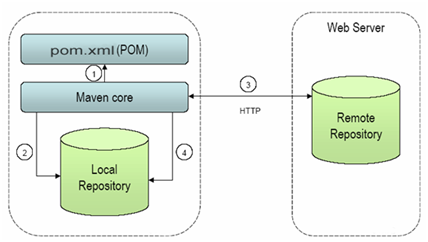
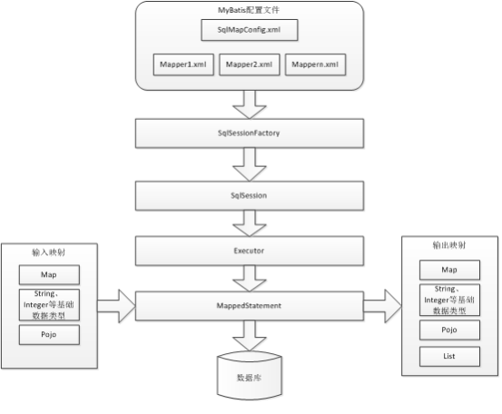

框架种类

```
jsp +servlet+jdbc(BaseDao) +filter ....                
ssm = spring  springmvc   mybatis（dao层）
sm  = springboot  mybatis
ssh  = spring  struts2    hibernate（dao层）
```

# maven

## maven工作原理

​            pom.xml为核心  管理jar   使用自带maven core  本地仓库获取jar,本地如果没有jar 使用配置的远程（阿里云的仓库）配置仓库，下载jar到本地仓库，再使用jar



## maven常用命令

​          mvn install:install-file -Dfile=F:\app\Administrator\product\11.1.0\db_1\jdbc\lib\ojdbc6.jar -DgroupId=com.oracle -DartifactId=ojdbc6 -Dversion=11.2.0.4.0  -Dpackaging=jar

## 本章重点

1, ORM 思想

2, mybatis 原理

3, mybatis 配置详解

## 具体内容

### ORM思想

对象关系映射（Object Relational Mapping，简称ORM） ORM是通过使用描述对象和数据库之间映射的元数据，元数据一般采用XML格式，并且存放在专门的对象一映射文件中。将程序中的对象自动持久化到关系数据库中。

### mybatis简介

#### mybatis官网：

https://mybatis.org/mybatis-3/zh/getting-started.html

   MyBatis 是一款优秀的持久层框架，它支持定制化 SQL、存储过程以及高级映射。MyBatis 避免了几乎所有的 JDBC 代码和手动设置参数以及获取结果集。MyBatis 可以使用简单的 XML 或注解来配置和映射原生类型、接口和 Java 的 POJO（Plain Old/Ordinary Java Objects，普通老式 Java 对象）为数据库中的记录。

## 结构图


架构分为三层：

接口层：给应用程序提供一系列的数据接口。（CRUD) ;SqlSession数据处理层：

接口层传递参数，sql命令，在数据处理层进行处理，返回对应的结果映射。

基础支撑层：提供最基础的底层的操作：连接管理（连接池），事务管理（增、删、改），配置加载

（读取配置信息），缓存（一级缓存，二级缓存）。

## mybatis 工作原理



## mybatis 快速入门（完成增删改查操作）

### 创建项目引入jar

```xml
<!--  mybatis包  -->
<dependency>
    <groupId>org.mybatis</groupId>
    <artifactId>mybatis</artifactId>
    <version>3.5.5</version>
</dependency>
<!--oracle驱动包
    mvn install:install-file -Dfile=F:\app\Administrator\product\11\dbhome\jdbc\lib\ojdbc6.jar -DgroupId=oracle -DartifactId=oracle-jdbc -Dversion=12.1.0.2  -Dpackaging=jar

    -->
<dependency>
    <groupId>oracle</groupId>
    <artifactId>oracle-jdbc</artifactId>
    <version>12.1.0.2</version>
</dependency>
```

创建mybatis主配置文件，创建数据源配置文件

```xml
<?xml version="1.0" encoding="UTF-8" ?>
<!DOCTYPE configuration
        PUBLIC "-//mybatis.org//DTD Config 3.0//EN"
        "http://mybatis.org/dtd/mybatis-3-config.dtd">
<!--dtd =document type definition 规定了当前文档类型定义格式-->
<configuration>
<!--  环境配置，可以配置多个环境  -->
    <environments default="development">
<!--    具体环境配置    -->
        <environment id="development">
<!--    事务管理配置 type="jdbc" 自行处理事务 type="managed"把事务交给容器管理        -->
            <transactionManager type="JDBC"/>
            <dataSource type="POOLED">
                <property name="driver" value="oracle.jdbc.driver.OracleDriver"/>
                <property name="url" value="jdbc:oracle:thin:@localhost:1521:orcl"/>
                <property name="username" value="scott"/>
                <property name="password" value="coby"/>
            </dataSource>
        </environment>
    </environments>
    <mappers>
        <mapper resource="mappers/DeptMapper.xml"/>
    </mappers>
</configuration>
```

### 创建mybatis Mapper文件

```xml
<?xml version="1.0" encoding="UTF-8" ?>
<!DOCTYPE mapper
        PUBLIC "-//mybatis.org//DTD Mapper 3.0//EN"
        "http://mybatis.org/dtd/mybatis-3-mapper.dtd">
<!--1.隔离语句；2.绑定接口-->
<mapper namespace="cn.cobight.mybatis.dao.DeptDao">
    <select id="listDept" resultType="cn.cobight.mybatis.entity.Dept">
        select deptno,dname deptName,loc from dept
    </select>
<!--  parameter可以省略   -->
    <select id="getDeptById" parameterType="int" resultType="cn.cobight.mybatis.entity.Dept">
        select deptno,dname deptName,loc from dept where deptno=#{deptNo}
    </select>
</mapper>
```

### 实体类Dept

```java
public class Dept {

    private Integer deptNo;
    private String deptName;
    private String loc;
    getter and setter
}    
```

### 代理的接口

```java
public interface DeptDao {
    List<Dept> listDept();
    Dept getDeptById(int deptNo);
}
```

### 代理的工厂类

```java
public class SqlSessionFactoryUtil {
    //1.私有构造
    private SqlSessionFactoryUtil(){}
    //2.静态私有属性
    private static SqlSessionFactory sqlSessionFactory;

    //静态单例模式
    static {
        //mybatis提供Resource  中提供getResourceAsStream根据资源得到流
        InputStream inputStream = null;
        try {
            inputStream = Resources.getResourceAsStream("mybatis-config.xml");
            //mybatis提供SqlSessionFactoryBuilder 中提供build方法用来创建工厂
            sqlSessionFactory = new SqlSessionFactoryBuilder().build(inputStream);
        } catch (IOException e) {
            e.printStackTrace();
        }finally {
            if (inputStream!=null) {
                try {
                    inputStream.close();
                } catch (IOException e) {
                    e.printStackTrace();
                }
            }
        }

    }
    //3.提供对外创建SqlSession方法
    public static SqlSession getSqlSession(){
        return sqlSessionFactory.openSession();
    }
}
```

### 测试类

```java
public class DeptDaoTest {
    @Test
    public void testListDept(){
        SqlSession sqlSession = null;
        try {
            sqlSession = SqlSessionFactoryUtil.getSqlSession();
            //使用JDK代理（代理接口）生成DeptDao代理对象
            DeptDao deptDao = sqlSession.getMapper(DeptDao.class);//多态
            //获取列表
            List<Dept> deptList = deptDao.listDept();
            //判断循环 输出
            if (deptList!=null&&deptList.size()>0){
                for (Dept dept : deptList) {
                    System.out.println("部门名称"+dept.getDeptName()+",位置："+dept.getLoc());
                }
            }
        } catch (Exception e) {
            e.printStackTrace();
        } finally {
            if (sqlSession!=null)sqlSession.close();
        }
    }

    @Test
    public void testGetDeptById(){
        SqlSession sqlSession = null;
        try {
            sqlSession = SqlSessionFactoryUtil.getSqlSession();
            //使用JDK代理（代理接口）生成DeptDao代理对象
            DeptDao deptDao = sqlSession.getMapper(DeptDao.class);//多态
            //获取列表
            Dept dept = deptDao.getDeptById(10);
            //判断循环 输出
            if (dept!=null){
                System.out.println("部门名称"+dept.getDeptName()+",位置："+dept.getLoc());

            }
        } catch (Exception e) {
            e.printStackTrace();
        } finally {
            if (sqlSession!=null)sqlSession.close();
        }
    }
}
```

