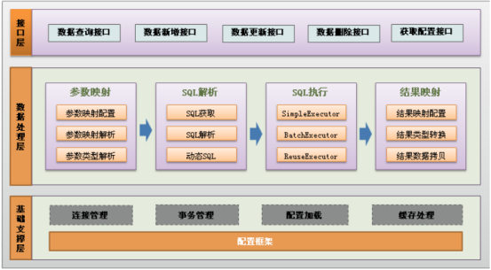

框架种类

```
jsp +servlet+jdbc(BaseDao) +filter ....                
ssm = spring  springmvc   mybatis（dao层）
sm  = springboot  mybatis
ssh  = spring  struts2    hibernate（dao层）
```

# maven

## maven工作原理

​            pom.xml为核心  管理jar   使用自带maven core  本地仓库获取jar,本地如果没有jar 使用配置的远程（阿里云的仓库）配置仓库，下载jar到本地仓库，再使用jar


## maven常用命令

```cmd
mvn install:install-file -Dfile=F:\app\Administrator\product\11.1.0\db_1\jdbc\lib\ojdbc6.jar -DgroupId=com.oracle -DartifactId=ojdbc6 -Dversion=11.2.0.4.0  -Dpackaging=jar
```


# mybatis

## 本章重点

1, ORM 思想

2, mybatis 原理

3, mybatis 配置详解

## 具体内容

### ORM思想

对象关系映射（Object Relational Mapping，简称ORM） ORM是通过使用描述对象和数据库之间映射的元数据，元数据一般采用XML格式，并且存放在专门的对象一映射文件中。将程序中的对象自动持久化到关系数据库中。

### mybatis简介

#### mybatis官网：

https://mybatis.org/mybatis-3/zh/getting-started.html

   MyBatis 是一款优秀的持久层框架，它支持定制化 SQL、存储过程以及高级映射。MyBatis 避免了几乎所有的 JDBC 代码和手动设置参数以及获取结果集。MyBatis 可以使用简单的 XML 或注解来配置和映射原生类型、接口和 Java 的 POJO（Plain Old/Ordinary Java Objects，普通老式 Java 对象）为数据库中的记录。

## mapper文件详解：

可配置标签：

cache – 对给定命名空间的缓存配置。

cache-ref – 对其他命名空间缓存配置的引用（已经不用了）。

resultMap – 是最复杂也是最强大的元素，用来描述如何从数据库结果集中来加载对象。

parameterMap – 已被废弃！老式风格的参数映射。更好的办法是使用内联参数，此元素可能在将来被移除。文档中不会介绍此元素。

sql – 可被其他语句引用的可重用语句块。

insert – 映射插入语句

update – 映射更新语句

delete – 映射删除语句

select – 映射查询语句

标签的属性描述： 

1）id：命名空间中唯一的标识符，可以来引用该条语句 也是接口的方法名称

2）parameterType：这里设置传入该条语句的参数类的完全限定名或者普通java类型 

3）resultType：返回结果的类的完全限定名或者普通java类型 

4）resultMap：外部resultMap的命名引用，结果集的映射是Mybatis最强大的特性 

5）flushCache：如果设置为true,则任何时候该语句被调用，都会导致本地缓存和二级缓存都被清空。默认是false 

6）useCache：如果设置为true，将会导致本条语句的结果被二级缓存。默认是true 

7）timeout：抛出异常之前，驱动程序等待数据库返回请求结果的秒数 

## 结构图



架构分为三层：

接口层：给应用程序提供一系列的数据接口。（CRUD) ;SqlSession数据处理层：

接口层传递参数，sql命令，在数据处理层进行处理，返回对应的结果映射。

基础支撑层：提供最基础的底层的操作：连接管理（连接池），事务管理（增、删、改），配置加载

（读取配置信息），缓存（一级缓存，二级缓存）。

## mybatis 工作原理


## ***\*关键类介绍:\****

***\*SqlSessionFactoryBuilder\****

这个类可以被实例化、使用和丢弃，一旦创建了 SqlSessionFactory，就不再需要它了。 因此 SqlSessionFactoryBuilder 实例的最佳作用域是方法作用域（也就是局部方法变量）。 你可以重用 SqlSessionFactoryBuilder 来创建多个 SqlSessionFactory 实例，但是最好还是不要让其一直存在，以保证所有的 XML 解析资源可以被释放给更重要的事情。

***\*SqlSessionFactory\****

SqlSessionFactory 一旦被创建就应该在应用的运行期间一直存在，没有任何理由丢弃它或重新创建另一个实例。 使用 SqlSessionFactory 的最佳实践是在应用运行期间不要重复创建多次，多次重建 SqlSessionFactory 被视为一种代码“坏味道（bad smell）”。因此 SqlSessionFactory 的最佳作用域是应用作用域。 有很多方法可以做到，最简单的就是使用单例模式或者静态单例模式。

***\*SqlSession\****

每个线程都应该有它自己的 SqlSession 实例。SqlSession 的实例不是线程安全的，因此是不能被共享的，所以它的最佳的作用域是请求或方法作用域。 绝对不能将 SqlSession 实例的引用放在一个类的静态域，甚至一个类的实例变量也不行。 也绝不能将 SqlSession 实例的引用放在任何类型的托管作用域中，比如 Servlet 框架中的 HttpSession。 如果你现在正在使用一种 Web 框架，要考虑 SqlSession 放在一个和 HTTP 请求对象相似的作用域中。 换句话说，每次收到的 HTTP 请求，就可以打开一个 SqlSession，返回一个响应，就关闭它。 这个关闭操作是很重要的，你应该把这个关闭操作放到 finally 块中以确保每次都能执行关闭。 

## mybatis 快速入门（完成增删改查操作）

### 创建项目引入jar

```xml
<!--  mybatis包  -->
<dependency>
    <groupId>org.mybatis</groupId>
    <artifactId>mybatis</artifactId>
    <version>3.5.5</version>
</dependency>
<!--oracle驱动包
    mvn install:install-file -Dfile=F:\app\Administrator\product\11\dbhome\jdbc\lib\ojdbc6.jar -DgroupId=oracle -DartifactId=oracle-jdbc -Dversion=12.1.0.2  -Dpackaging=jar

    -->
<dependency>
    <groupId>oracle</groupId>
    <artifactId>oracle-jdbc</artifactId>
    <version>12.1.0.2</version>
</dependency>
```

创建mybatis主配置文件，创建数据源配置文件

```xml
<?xml version="1.0" encoding="UTF-8" ?>
<!DOCTYPE configuration
        PUBLIC "-//mybatis.org//DTD Config 3.0//EN"
        "http://mybatis.org/dtd/mybatis-3-config.dtd">
<!--dtd =document type definition 规定了当前文档类型定义格式-->
<configuration>
<!--  环境配置，可以配置多个环境  -->
    <environments default="development">
<!--    具体环境配置    -->
        <environment id="development">
<!--    事务管理配置 type="jdbc" 自行处理事务 type="managed"把事务交给容器管理        -->
            <transactionManager type="JDBC"/>
            <!--数据源：连接池技术-->
            <dataSource type="POOLED">
                <property name="driver" value="oracle.jdbc.driver.OracleDriver"/>
                <property name="url" value="jdbc:oracle:thin:@localhost:1521:orcl"/>
                <property name="username" value="scott"/>
                <property name="password" value="coby"/>
            </dataSource>
        </environment>
    </environments>
    <mappers>
        <mapper resource="mappers/DeptMapper.xml"/>
    </mappers>
</configuration>
```

### 创建mybatis Mapper文件

```xml
<?xml version="1.0" encoding="UTF-8" ?>
<!DOCTYPE mapper
        PUBLIC "-//mybatis.org//DTD Mapper 3.0//EN"
        "http://mybatis.org/dtd/mybatis-3-mapper.dtd">
<!--1.隔离语句；2.绑定接口-->
<mapper namespace="cn.cobight.mybatis.dao.DeptDao">
    <select id="listDept" resultType="cn.cobight.mybatis.entity.Dept">
        select deptno,dname deptName,loc from dept
    </select>
<!--  parameter可以省略   -->
    <select id="getDeptById" parameterType="int" resultType="cn.cobight.mybatis.entity.Dept">
        select deptno,dname deptName,loc from dept where deptno=#{deptNo}
    </select>
</mapper>
```

### 实体类Dept

```java
public class Dept {

    private Integer deptNo;
    private String deptName;
    private String loc;
    getter and setter
}    
```

### 代理的接口

```java
public interface DeptDao {
    List<Dept> listDept();
    Dept getDeptById(int deptNo);
}
```

### 代理的工厂类

```java
public class SqlSessionFactoryUtil {
    //1.私有构造
    private SqlSessionFactoryUtil(){}
    //2.静态私有属性
    private static SqlSessionFactory sqlSessionFactory;

    //静态单例模式
    static {
        //mybatis提供Resource  中提供getResourceAsStream根据资源得到流
        InputStream inputStream = null;
        try {
            inputStream = Resources.getResourceAsStream("mybatis-config.xml");
            //mybatis提供SqlSessionFactoryBuilder 中提供build方法用来创建工厂
            sqlSessionFactory = new SqlSessionFactoryBuilder().build(inputStream);
        } catch (IOException e) {
            e.printStackTrace();
        }finally {
            if (inputStream!=null) {
                try {
                    inputStream.close();
                } catch (IOException e) {
                    e.printStackTrace();
                }
            }
        }

    }
    //3.提供对外创建SqlSession方法
    public static SqlSession getSqlSession(){
        return sqlSessionFactory.openSession();
    }
}
```

### 测试类

```java
public class DeptDaoTest {
    @Test
    public void testListDept(){
        SqlSession sqlSession = null;
        try {
            sqlSession = SqlSessionFactoryUtil.getSqlSession();
            //使用JDK代理（代理接口）生成DeptDao代理对象
            DeptDao deptDao = sqlSession.getMapper(DeptDao.class);//多态
            //获取列表
            List<Dept> deptList = deptDao.listDept();
            //判断循环 输出
            if (deptList!=null&&deptList.size()>0){
                for (Dept dept : deptList) {
                    System.out.println("部门名称"+dept.getDeptName()+",位置："+dept.getLoc());
                }
            }
        } catch (Exception e) {
            e.printStackTrace();
        } finally {
            if (sqlSession!=null)sqlSession.close();
        }
    }

    @Test
    public void testGetDeptById(){
        SqlSession sqlSession = null;
        try {
            sqlSession = SqlSessionFactoryUtil.getSqlSession();
            //使用JDK代理（代理接口）生成DeptDao代理对象
            DeptDao deptDao = sqlSession.getMapper(DeptDao.class);//多态
            //获取列表
            Dept dept = deptDao.getDeptById(10);
            //判断循环 输出
            if (dept!=null){
                System.out.println("部门名称"+dept.getDeptName()+",位置："+dept.getLoc());

            }
        } catch (Exception e) {
            e.printStackTrace();
        } finally {
            if (sqlSession!=null)sqlSession.close();
        }
    }
}
```

## mybatis 基础语句集合

### 实体类Dept

```java
public class Dept {

    private Integer deptNo;
    private String deptName;
    private String loc;

    public Integer getDeptNo() {
        return deptNo;
    }

    public void setDeptNo(Integer deptNo) {
        this.deptNo = deptNo;
    }

    public String getDeptName() {
        return deptName;
    }

    public void setDeptName(String deptName) {
        this.deptName = deptName;
    }

    public String getLoc() {
        return loc;
    }

    public void setLoc(String loc) {
        this.loc = loc;
    }
}
```

### 测试基础语句的接口

```java
public interface DeptDao {
    //select案例入门
    List<Dept> listDept();
    //带参查找
    Dept getDeptById(int deptNo);
    //if语句
    List<Dept> listDeptByParamIf(Dept dept);
    //if + where
    List<Dept> listDeptByParamIfWhere(Dept dept);
    //choose when otherwise选择，类似switch
    List<Dept> listDeptByParamChoose(Dept dept);
    //set用法
    int updateDeptParam(Dept dept);
    //加头与去头
    List<Dept> listDeptByParamTrim(Dept dept);
    //遍历
    List<Dept> listDeptByParamForeach(List list);
}
```

### mapper配置

```java
<?xml version="1.0" encoding="UTF-8" ?>
<!DOCTYPE mapper
        PUBLIC "-//mybatis.org//DTD Mapper 3.0//EN"
        "http://mybatis.org/dtd/mybatis-3-mapper.dtd">
<!--1.隔离语句；2.绑定接口-->
<mapper namespace="cn.cobight.mybatis.dao.DeptDao">
<!--  部门列表查询  -->
    <select id="listDept" resultType="cn.cobight.mybatis.entity.Dept">
        select deptno,dname deptName,loc from dept
    </select>
<!--  部门列表查询  -->
    <select id="listDeptByParamIf" parameterType="dept" resultType="cn.cobight.mybatis.entity.Dept">
        select deptno,dname deptName,loc from dept where 1=1
        <if test="deptNo != null">
            and deptno = #{deptNo}
        </if>
        <if test="deptName != null and deptName != '' ">
            and dname like '%'||#{deptName}||'%'
<!--             and deptno like '%${deptName}%' -->
        </if>
    </select>
<!--  parameter可以省略   -->
    <select id="getDeptById" parameterType="int" resultType="cn.cobight.mybatis.entity.Dept">
        select deptno,dname deptName,loc from dept where deptno=#{deptNo}
    </select>
<!--  if + where 用法 -->
    <select id="listDeptByParamIfWhere" parameterType="dept" resultType="cn.cobight.mybatis.entity.Dept">
        select deptno,dname deptName,loc from dept
        <where>
            <if test="deptNo != null">
                and deptno = #{deptNo}
            </if>
            <if test="deptName != null and deptName != '' ">
                and dname like '%'||#{deptName}||'%'
                <!--             and deptno like '%${deptName}%' -->
            </if>
        </where>
    </select>
<!-- Choose 用法 -->
    <select id="listDeptByParamChoose" parameterType="dept" resultType="cn.cobight.mybatis.entity.Dept">
        select deptno,dname deptName,loc from dept
        <where>
            <choose>
                <when test="deptNo != null">
                    and deptno = #{deptNo}
                </when>
                <when test="deptName != null and deptName != '' ">
                    and dname like '%'||#{deptName}||'%'
                    <!--             and deptno like '%${deptName}%' -->
                </when>
                <when test="loc != null and loc != '' ">
                    and loc = #{loc}
                </when>
                <otherwise>
                    and 1=1
                </otherwise>
            </choose>
        </where>
    </select>
    <sql id="publicSql">
        select deptno,dname deptName,loc
    </sql>
<!-- 查询列表foreach -->
    <select id="listDeptByParamForeach" parameterType="list" resultType="dept">
         <include refid="publicSql"></include> from dept where deptno in
--           集合(10,20,30,40)   separator分隔器
        <foreach collection="list" open="(" close=")" separator="," item="dno">
            #{dno}
        </foreach>
    </select>
<!-- 部门更新 （set + if）根据参数动态拼接更新语句
    更操作（insert update delete）不能有resultType resultMap
-->
    <update id="updateDeptParam" parameterType="dept">
        update dept
        <trim prefix="set" suffixOverrides=",">
            <if test="deptName != null and deptName != ''">-->
                dname=#{deptName},
            </if>
            <if test="loc != null and loc != ''">
                dname=#{loc},
            </if>
        </trim>
<!--        <set>-->
<!--&#45;&#45;         多个条件至少满足一个，若都不满足，会报错-->
<!--&#45;&#45;         这个例子中，set 元素会动态地在行首插入 SET 关键字，并会删掉额外的逗号（这些逗号是在使用条件语句给列赋值时引入的）。-->
<!--            <if test="deptName != null and deptName != ''">-->
<!--                dname=#{deptName},-->
<!--            </if>-->
<!--            <if test="loc != null and loc != ''">-->
<!--                dname=#{loc},-->
<!--            </if>-->
<!--        </set>-->
        where deptno=#{deptNo}
    </update>
<!--  if + trim 用法 -->
    <select id="listDeptByParamTrim" parameterType="dept" resultType="cn.cobight.mybatis.entity.Dept">
        select deptno,dname deptName,loc from dept
--         prefix整体加前缀，suffix整体加后缀
--         prefixOverrides子句删前缀，suffixOverrides子句删后缀
--         <trim suffix="" suffixOverrides=","></trim>
        <trim prefix="where" prefixOverrides="and|or">
            <if test="deptNo != null">
                and deptno = #{deptNo}
            </if>
            <if test="deptName != null and deptName != '' ">
                and dname like '%'||#{deptName}||'%'
                <!--             and deptno like '%${deptName}%' -->
            </if>
        </trim>
    </select>
</mapper>
```

### 测试类

```java
package cn.cobight.mybatis.test;

import cn.cobight.mybatis.dao.DeptDao;
import cn.cobight.mybatis.entity.Dept;
import cn.cobight.mybatis.util.SqlSessionFactoryUtil;
import org.apache.ibatis.session.SqlSession;
import org.junit.Test;

import java.util.ArrayList;
import java.util.List;

/**
 * fileName:DeptDaoTest
 * description:
 * author:cobight
 * createTime:2020/9/15 20:53
 * version:1.0.0
 */
public class DeptDaoTest {
    @Test
    public void testListDept(){
        SqlSession sqlSession = null;
        try {
            sqlSession = SqlSessionFactoryUtil.getSqlSession();
            //使用JDK代理（代理接口）生成DeptDao代理对象
            DeptDao deptDao = sqlSession.getMapper(DeptDao.class);//多态
            //获取列表
            List<Dept> deptList = deptDao.listDept();
            //判断循环 输出
            if (deptList!=null&&deptList.size()>0){
                for (Dept dept : deptList) {
                    System.out.println("部门名称"+dept.getDeptName()+",位置："+dept.getLoc());
                }
            }
        } catch (Exception e) {
            e.printStackTrace();
        } finally {
            if (sqlSession!=null)sqlSession.close();
        }
    }

    @Test
    public void testGetDeptById(){
        SqlSession sqlSession = null;
        try {
            sqlSession = SqlSessionFactoryUtil.getSqlSession();
            //使用JDK代理（代理接口）生成DeptDao代理对象
            DeptDao deptDao = sqlSession.getMapper(DeptDao.class);//多态
            //获取列表
            Dept dept = deptDao.getDeptById(10);
            //判断循环 输出
            if (dept!=null){
                System.out.println("部门名称"+dept.getDeptName()+",位置："+dept.getLoc());

            }
        } catch (Exception e) {
            e.printStackTrace();
        } finally {
            if (sqlSession!=null)sqlSession.close();
        }
    }

    @Test
    public void listDeptByParamIf(){
        SqlSession sqlSession = null;
        try {
            sqlSession = SqlSessionFactoryUtil.getSqlSession();
            //使用JDK代理（代理接口）生成DeptDao代理对象
            DeptDao deptDao = sqlSession.getMapper(DeptDao.class);//多态

            Dept dept1 = new Dept();
           dept1.setDeptNo(20);
            dept1.setDeptName("A");
            List<Dept> deptList = deptDao.listDeptByParamIf(dept1);

            //判断循环 输出
            if (deptList!=null&&deptList.size()>0){
                for (Dept dept : deptList) {
                    System.out.println("部门名称"+dept.getDeptName()+",位置："+dept.getLoc());
                }

            }
        } catch (Exception e) {
            e.printStackTrace();
        } finally {
            if (sqlSession!=null)sqlSession.close();
        }
    }

    @Test
    public void listDeptByParamIfWhere(){
        SqlSession sqlSession = null;
        try {
            sqlSession = SqlSessionFactoryUtil.getSqlSession();
            //使用JDK代理（代理接口）生成DeptDao代理对象
            DeptDao deptDao = sqlSession.getMapper(DeptDao.class);//多态

            Dept dept1 = new Dept();
            dept1.setDeptNo(20);
            dept1.setDeptName("A");
            List<Dept> deptList = deptDao.listDeptByParamIfWhere(dept1);

            //判断循环 输出
            if (deptList!=null&&deptList.size()>0){
                for (Dept dept : deptList) {
                    System.out.println("部门名称"+dept.getDeptName()+",位置："+dept.getLoc());
                }

            }
        } catch (Exception e) {
            e.printStackTrace();
        } finally {
            if (sqlSession!=null)sqlSession.close();
        }
    }
    @Test
    public void listDeptByParamChoose(){
        SqlSession sqlSession = null;
        try {
            sqlSession = SqlSessionFactoryUtil.getSqlSession();
            //使用JDK代理（代理接口）生成DeptDao代理对象
            DeptDao deptDao = sqlSession.getMapper(DeptDao.class);//多态

            Dept dept1 = new Dept();
            dept1.setDeptNo(20);
            dept1.setDeptName("A");
            List<Dept> deptList = deptDao.listDeptByParamChoose(dept1);

            //判断循环 输出
            if (deptList!=null&&deptList.size()>0){
                for (Dept dept : deptList) {
                    System.out.println("部门名称"+dept.getDeptName()+",位置："+dept.getLoc());
                }

            }
        } catch (Exception e) {
            e.printStackTrace();
        } finally {
            if (sqlSession!=null)sqlSession.close();
        }
    }

    @Test
    public void updateDeptParam(){
        SqlSession sqlSession = null;
        try {
            sqlSession = SqlSessionFactoryUtil.getSqlSession();
            //使用JDK代理（代理接口）生成DeptDao代理对象
            DeptDao deptDao = sqlSession.getMapper(DeptDao.class);//多态

            Dept dept1 = new Dept();
            dept1.setDeptNo(20);
            dept1.setDeptName("RESEARCH1");
            int result = deptDao.updateDeptParam(dept1);
//          事务提交
            sqlSession.commit();
            //判断循环 输出
            if (result>0){
                System.out.println("执行成功");
            }else {
                System.out.println("执行失败");
            }
        } catch (Exception e) {
            e.printStackTrace();
        } finally {
            if (sqlSession!=null)sqlSession.close();
        }
    }

    @Test
    public void listDeptByParamTrim(){
        SqlSession sqlSession = null;
        try {
            sqlSession = SqlSessionFactoryUtil.getSqlSession();
            //使用JDK代理（代理接口）生成DeptDao代理对象
            DeptDao deptDao = sqlSession.getMapper(DeptDao.class);//多态

            Dept dept1 = new Dept();
            //dept1.setDeptNo(20);
            dept1.setDeptName("A");
            List<Dept> deptList = deptDao.listDeptByParamTrim(dept1);

            //判断循环 输出
            if (deptList!=null&&deptList.size()>0){
                for (Dept dept : deptList) {
                    System.out.println("部门名称"+dept.getDeptName()+",位置："+dept.getLoc());
                }

            }
        } catch (Exception e) {
            e.printStackTrace();
        } finally {
            if (sqlSession!=null)sqlSession.close();
        }
    }

    @Test
    public void listDeptByParamForeach(){
        SqlSession sqlSession = null;
        try {
            sqlSession = SqlSessionFactoryUtil.getSqlSession();
            //使用JDK代理（代理接口）生成DeptDao代理对象
            DeptDao deptDao = sqlSession.getMapper(DeptDao.class);//多态

            List paramList = new ArrayList();
            paramList.add(10);
            paramList.add(11);
            paramList.add(20);
            paramList.add(40);
            List<Dept> deptList = deptDao.listDeptByParamForeach(paramList);

            //判断循环 输出
            if (deptList!=null&&deptList.size()>0){
                for (Dept dept : deptList) {
                    System.out.println("部门名称"+dept.getDeptName()+",位置："+dept.getLoc());
                }

            }
        } catch (Exception e) {
            e.printStackTrace();
        } finally {
            if (sqlSession!=null)sqlSession.close();
        }
    }
}
```

## mybatis结果映射、关联查询

### 实体类

```java
public class Emp {
    private Integer empNo;
    private String empName;
    private Double salary;
    private String job;
    //多对一，一对一
    private Dept dept;
    
    getter and setter...
}
```

### 测试接口

```java
public interface EmpDao {

    List<Emp> listEmpsAndDept();
}
```

### mapper配置

```java
<?xml version="1.0" encoding="UTF-8" ?>
<!DOCTYPE mapper
        PUBLIC "-//mybatis.org//DTD Mapper 3.0//EN"
        "http://mybatis.org/dtd/mybatis-3-mapper.dtd">
<!--1.隔离语句；2.绑定接口-->
<mapper namespace="cn.cobight.mybatis.dao.EmpDao">

    <select id="listEmpsAndDept" resultMap="empsAndDept">
        select e.empno,e.ename,e.sal,e.job,d.deptno,d.dname,d.loc
        from emp e join dept d on e.deptno = d.deptno
    </select>
<!--  高级结果映射  -->
    <resultMap id="empsAndDept" type="emp">
        <id column="en" property="empNo" javaType="Integer" jdbcType="INTEGER"></id>
        <result column="ename" property="empName"></result>
        <result column="sal" property="salary"></result>
        <result column="job" property="job"></result>
<!--   关联  一对一或者多对一   -->
        <association property="dept" javaType="cn.cobight.mybatis.entity.Dept">
            <id column="deptno" property="deptNo"></id>
            <result column="dname" property="deptName"></result>
            <result column="loc" property="loc"></result>
        </association>
    </resultMap>
</mapper>
```

### 测试类

```java
public class EmpDaoTest {
    @Test
    public void testListEmpsAndDept(){
        SqlSession sqlSession = null;
        try {
            sqlSession = SqlSessionFactoryUtil.getSqlSession();
            EmpDao empDao = sqlSession.getMapper(EmpDao.class);
            List<Emp> emps = empDao.listEmpsAndDept();
            if (emps!=null && emps.size()>0){
                for (Emp emp : emps) {
                    System.out.println("员工名称："+emp.getEmpName()+"该员工的部门为：");
                    Dept dept = emp.getDept();
                    if (dept!=null){
                        System.out.println("--------------"+dept.getDeptName());
                    }
                }
            }
        } catch (Exception e) {
            e.printStackTrace();
        } finally {
            if (sqlSession!=null)sqlSession.close();
        }
    }
}
```

## mybatis多对一，多对多

### 新闻分类案例

#### 实体类

```java
public class NewsType {
    private Integer typeId;
    private String tname;
    private Date addTime;
    //多对多或者一对多  在一的一方要写多的一方集合
    private List<News> newsList;
    getter and setter...
}
public class News {
    private Integer newsId;
    private String title;
    private Date addTime;
    private NewsType newsType;
    getter and setter...
}
```

#### dao

```java
public interface NewsTypeDao {
    List<NewsType> listNewsTypeAndNews();
}
```

#### mapper配置

```xml
<?xml version="1.0" encoding="UTF-8" ?>
<!DOCTYPE mapper
        PUBLIC "-//mybatis.org//DTD Mapper 3.0//EN"
        "http://mybatis.org/dtd/mybatis-3-mapper.dtd">
<mapper namespace="cn.cobight.mybatis.dao.NewsTypeDao">
    <select id="listNewsTypeAndNews" resultMap="newsTypeAndNews">
        select t.type_id, t.tname, n.news_id, n.title, n.addtime, n.content
          from tb_news n
         right join tb_news_type t
            on n.type_id = t.type_id
    </select>
    <resultMap id="newsTypeAndNews" type="NewsType">
        <id column="type_id" property="typeId"></id>
        <result column="tname" property="tname"></result>
        <collection property="newsList" ofType="News">
            <id column="news_id" property="newsId"></id>
            <result column="title" property="title"></result>
            <result column="addtime" property="addTime"></result>
        </collection>
    </resultMap>
</mapper>
```

#### 测试类

```java
public class NewsTypeDaoTest {
    @Test
    public void newsTypeAndNews(){
        SqlSession sqlSession = null;
        try {
            sqlSession = SqlSessionFactoryUtil.getSqlSession();
            NewsTypeDao newsTypeDao = sqlSession.getMapper(NewsTypeDao.class);
            List<NewsType> newsTypes = newsTypeDao.listNewsTypeAndNews();
            if (newsTypes!=null&& newsTypes.size()>0){
                for (NewsType newsType : newsTypes) {
                    System.out.println("分类名："+newsType.getTname());
                    List<News> newsList = newsType.getNewsList();
                    SimpleDateFormat sdf = new SimpleDateFormat("yyyy-MM-dd HH:mm:ss");
                    if (newsList!=null && newsList.size()>0){
                        for (News news : newsList) {
                            System.out.println("-------"+news.getTitle()+"\t"+sdf.format(news.getAddTime()));
                        }
                    }
                }
            }
        } catch (Exception e) {
            e.printStackTrace();
        } finally {
            if (sqlSession!=null)sqlSession.close();
        }
    }
}
out：
==>  Preparing: select t.type_id, t.tname, n.news_id, n.title, n.addtime, n.content from tb_news n right join tb_news_type t on n.type_id = t.type_id
==> Parameters: 
<==    Columns: TYPE_ID, TNAME, NEWS_ID, TITLE, ADDTIME, CONTENT
<==        Row: 2, 国际新闻2, 1, 新闻标题1, 2020-09-17 00:00:00.0, <<BLOB>>
<==        Row: 3, 国际新闻3, 2, 新闻标题2, 2020-09-17 00:00:00.0, <<BLOB>>
<==        Row: 5, 国际新闻, 3, 新闻标题3, 2020-09-17 00:00:00.0, <<BLOB>>
<==        Row: 2, 国际新闻2, 4, 新闻标题4, 2020-09-17 00:00:00.0, <<BLOB>>
<==      Total: 4
分类名：国际新闻2
-------新闻标题1	2020-09-17 00:00:00
-------新闻标题4	2020-09-17 00:00:00
分类名：国际新闻3
-------新闻标题2	2020-09-17 00:00:00
分类名：国际新闻
-------新闻标题3	2020-09-17 00:00:00 
```

### 用户分类案例

#### 实体类

```java
public class Users {
    private Integer userId;
    private String userName;
    private String realName;
    private Integer age;
    private List<Roles> roles;
    getter and setter...
}
public class Roles {
    private Integer roleId;
    private String roleName;
    private String describe;
    getter and setter...
}
```

#### dao

```java
public interface UsersAndRolesDao {
    List<Users> listGetUsersAndRoles();
}
```

#### mapper

```xml
<?xml version="1.0" encoding="UTF-8" ?>
<!DOCTYPE mapper
        PUBLIC "-//mybatis.org//DTD Mapper 3.0//EN"
        "http://mybatis.org/dtd/mybatis-3-mapper.dtd">
<mapper namespace="cn.cobight.mybatis.dao.UsersAndRolesDao">
    <select id="listGetUsersAndRoles" resultMap="usersAndRoles">
        select u.user_id,u.user_name,u.real_name,u.age,r.role_id,r.role_name from tb_user u
        left join tb_user_role ur  on u.user_id=ur.user_id
        left join tb_role r on ur.role_id=r.role_id
    </select>
    <resultMap id="usersAndRoles" type="Users">
        <id column="user_id" property="userId"></id>
        <result column="user_name" property="userName"></result>
        <result column="real_name" property="realName"></result>
        <result column="age" property="age"></result>
        <collection property="roles" ofType="Roles">
            <id column="role_id" property="roleId"></id>
            <result column="role_name" property="roleName"></result>
        </collection>
    </resultMap>
</mapper>
```

#### 测试类

```java
public class UsersAndRolesDaoTest {
    @Test
    public void usersAndRoles(){
        SqlSession sqlSession = null;
        try {
            sqlSession = SqlSessionFactoryUtil.getSqlSession();
            UsersAndRolesDao usersAndRolesDao = sqlSession.getMapper(UsersAndRolesDao.class);
            List<Users> listGetUsersAndRoles = usersAndRolesDao.listGetUsersAndRoles();
            if (listGetUsersAndRoles!=null&& listGetUsersAndRoles.size()>0){
                for (Users users : listGetUsersAndRoles) { System.out.println(users.getUserId()+"\t"+users.getUserName()+"\t"+users.getRealName()+"\t"+users.getAge());
                    List<Roles> roles = users.getRoles();
                    if (roles!=null&&roles.size()>0){
                        for (Roles role : roles) {
                            System.out.println("-------"+role.getRoleId()+"\t"+role.getRoleName());
                        }
                    }
                }
            }
        } catch (Exception e) {
            e.printStackTrace();
        } finally {
            if (sqlSession!=null)sqlSession.close();
        }
    }
}
```

## mybatis调用存储过程

### 存储过程

```plsql
create or replace procedure pro_select_empinfo_bydname
(i_dname in dept.dname%type,o_result out sys_refcursor)--引用游标类型
is
  t_deptno dept.deptno%type;
begin
  --根据部门名称获取部门 ID
  select deptno into t_deptno from dept where dname=i_dname;
  --根据部门编号查询员工信息
  open o_result for select * from emp where deptno=t_deptno;
  exception
    when no_data_found then
      dbms_output.put_line('未找到数据');
end;

```

### 实体类

```java
public class Emp {
    private Integer empNo;
    private String empName;
    private Double salary;
    private String job;
    getter and setter...
}
```

### dao

```java
public interface EmpDao {
    void execProListEmpsByDeptName(Map paramMap);
}
```

### mapper

```xml
<?xml version="1.0" encoding="UTF-8" ?>
<!DOCTYPE mapper
        PUBLIC "-//mybatis.org//DTD Mapper 3.0//EN"
        "http://mybatis.org/dtd/mybatis-3-mapper.dtd">
<mapper namespace="cn.cobight.mybatis.dao.EmpDao">
    <select id="execProListEmpsByDeptName" parameterType="map" statementType="CALLABLE">
        {call pro_select_empinfo_bydname(
        #{deptName,mode=IN,javaType=String,jdbcType=VARCHAR},
        #{empList,mode=OUT,javaType=ResultSet,jdbcType=CURSOR,resultMap=emps}
        )}
    </select>
    <resultMap id="emps" type="emp">
        <id column="empno" property="empNo"></id>
        <result column="ename" property="empName"></result>
        <result column="sal" property="salary"></result>
        <result column="job" property="job"></result>
    </resultMap>
</mapper>
```

### 测试类

```java
public class EmpCallTest {
    @Test
    public void EmpCall(){
        SqlSession sqlSession = null;
        try {
            sqlSession = SqlSessionFactoryUtil.getSqlSession();
            EmpDao empDao = sqlSession.getMapper(EmpDao.class);
            Map paramMap = new HashMap();
            paramMap.put("deptName","ACCOUNTING");
            paramMap.put("empList",new ArrayList<>());
            empDao.execProListEmpsByDeptName(paramMap);
            List<Emp> empList = (List<Emp>)paramMap.get("empList");
            if (empList!=null&&empList.size()>0){
                for (Emp emp : empList) {
                    System.out.println(emp.getEmpNo()+"\t"+emp.getEmpName()+"\t"+emp.getJob()+"\t"+emp.getSalary());
                }
            }
        } catch (Exception e) {
            e.printStackTrace();
        } finally {
            if (sqlSession!=null)sqlSession.close();
        }
    }
}
```

# mybatis全局配置

https://mybatis.org/mybatis-3/zh/configuration.html

## setting配置

https://mybatis.org/mybatis-3/zh/configuration.html#settings

```xml
<!-- 全局配置设置 -->
<settings>
    <!--   让控制台打印执行语句     -->
    <setting name="logImpl" value="STDOUT_LOGGING"/><!--控制台打印输出-->
    <setting name="jdbcTypeForNull" value="NULL"/><!--NULL、VARCHAR、OTHER-->
</settings>
```

## typeAliases别名配置

https://mybatis.org/mybatis-3/zh/configuration.html#typeAliases

```xml
<!--  别名配置  -->
<typeAliases>
    <!--单个：<typeAlias type="cn.cobight.mybatis.entity.Dept" alias="Dept"></typeAlias>-->
    <package name="cn.cobight.mybatis.entity"/>
</typeAliases>
```

# 一二级缓存

https://www.cnblogs.com/happyflyingpig/p/7739749.html

## mapper

```xml
<?xml version="1.0" encoding="UTF-8" ?>
<!DOCTYPE mapper
        PUBLIC "-//mybatis.org//DTD Mapper 3.0//EN"
        "http://mybatis.org/dtd/mybatis-3-mapper.dtd">
<!--1,隔离语句 2，绑定接口-->
<mapper namespace="com.aaa.mybatis.dao.DeptDao">
    <!--默认缓存标签  使用默认属性  二级缓存可以能调用第三方做缓存，涉及对象传输，对象一定要序列化-->
    <cache   ></cache>
    <!--部门列表查询  useCache="false" 不写默认为true  useCache="false"不使用缓存 -->
    <select id="listDept" resultType="com.aaa.mybatis.entity.Dept" >
       <!--查询映射不区分大小写-->
       select deptno,dname as deptName,loc from dept
    </select>

    <select id="listDeptA" resultType="com.aaa.mybatis.entity.Dept" >
        <!--查询映射不区分大小写-->
        select deptno,dname as deptName,loc from dept
    </select>
    <select id="listDeptB" resultType="com.aaa.mybatis.entity.Dept" >
        <!--查询映射不区分大小写-->
        select deptno,dname as deptName,loc from dept
    </select>
    <!--部门更新（set+if根据参数动态拼接更新语句）
      更新操作（insert update delete）不能有resultType  resultMap-->
    <update id="updateDeptByParam" parameterType="dept">
           update dept
           <!--
             多个条件时，至少满足一个条件，如果一个不满足，就会报错
           set 元素会动态地在行首插入 SET 关键字 并会删掉额外的逗号-->
        <!--suffixOverrides="," 后缀替换掉  -->
        <trim prefix="set" suffixOverrides=",">
            <if test="deptName!=null and deptName!=''">
                dname = #{deptName},
            </if>
            <if test="loc!=null and loc!=''">
                loc = #{loc},
            </if>
        </trim>
          <!-- <set>
               <if test="deptName!=null and deptName!=''">
                   dname = #{deptName},
               </if>
               <if test="loc!=null and loc!=''">
                   loc = #{loc},
               </if>
           </set>-->
            where deptno=#{deptNo}
    </update>

    <!--部门添加  解决无效类类型1111 错误，1，把为null的字段添加上jdbcType=VARCHAR ，列很多，写着复杂
                                           2，在全局setting配置中配置jdbcTypeForNull =NULL-->
    <insert id="add" parameterType="dept">
    <!--insert into dept values(seq_dept_id.nextval,#{deptName},#{loc,jdbcType=VARCHAR})-->
      insert into dept values(seq_dept_id.nextval,#{deptName},#{loc})
  </insert>

  <!--部门删除   当执行语句只有参数时，参数名称可以不和形参对应-->
    <delete id="deleteById"  parameterType="int">
    delete from dept where deptno = #{dn}
</delete>
    <!--<delete id="deleteById"  >
         delete from dept where deptno = #{dn} and dname=#{de}
    </delete>-->
</mapper>
```

## 概念

MyBatis 内置了一个强大的事务性查询缓存机制，它可以非常方便地配置和定制。 为了使它更加强大而且易于配置，我们对 MyBatis 3 中的缓存实现进行了许多改进。

默认情况下，只启用了本地的会话缓存，它仅仅对一个会话中的数据进行缓存。 要启用全局的二级缓存，只需要在你的 SQL 映射文件中添加一行：

```
<cache/>
```

基本上就是这样。这个简单语句的效果如下:

- 映射语句文件中的所有 select 语句的结果将会被缓存。
- 映射语句文件中的所有 insert、update 和 delete 语句会刷新缓存。
- **缓存会使用最近最少使用算法（LRU, Least Recently Used）算法来清除不需要的缓存。**
- 缓存不会定时进行刷新（也就是说，没有刷新间隔）。
- 缓存会保存列表或对象（无论查询方法返回哪种）的 1024 个引用。
- 缓存会被视为读/写缓存，这意味着获取到的对象并不是共享的，可以安全地被调用者修改，而不干扰其他调用者或线程所做的潜在修改。

**提示** 缓存只作用于 cache 标签所在的映射文件中的语句。如果你混合使用 Java API 和 XML 映射文件，在共用接口中的语句将不会被默认缓存。你需要使用 @CacheNamespaceRef 注解指定缓存作用域。

这些属性可以通过 cache 元素的属性来修改。比如：

```
<cache
  eviction="FIFO"
  flushInterval="60000"
  size="512"
  readOnly="true"/>
```

这个更高级的配置创建了一个 FIFO 缓存，每隔 60 秒刷新，最多可以存储结果对象或列表的 512 个引用，而且返回的对象被认为是只读的，因此对它们进行修改可能会在不同线程中的调用者产生冲突。

可用的清除策略有：

- `LRU` – 最近最少使用：移除最长时间不被使用的对象。
- `FIFO` – 先进先出：按对象进入缓存的顺序来移除它们。
- `SOFT` – 软引用：基于垃圾回收器状态和软引用规则移除对象。
- `WEAK` – 弱引用：更积极地基于垃圾收集器状态和弱引用规则移除对象。

默认的清除策略是 LRU。

flushInterval（刷新间隔）属性可以被设置为任意的正整数，设置的值应该是一个以毫秒为单位的合理时间量。 默认情况是不设置，也就是没有刷新间隔，缓存仅仅会在调用语句时刷新。

size（引用数目）属性可以被设置为任意正整数，要注意欲缓存对象的大小和运行环境中可用的内存资源。默认值是 1024。

readOnly（只读）属性可以被设置为 true 或 false。只读的缓存会给所有调用者返回缓存对象的相同实例。 因此这些对象不能被修改。这就提供了可观的性能提升。而可读写的缓存会（通过序列化）返回缓存对象的拷贝。 速度上会慢一些，但是更安全，因此默认值是 false。

**提示** 二级缓存是事务性的。这意味着，当 SqlSession 完成并提交时，或是完成并回滚，但没有执行 flushCache=true 的 insert/delete/update 语句时，缓存会获得更新。

请注意，缓存的配置和缓存实例会被绑定到 SQL 映射文件的命名空间中。 因此，同一命名空间中的所有语句和缓存将通过命名空间绑定在一起。 每条语句可以自定义与缓存交互的方式，或将它们完全排除于缓存之外，这可以通过在每条语句上使用两个简单属性来达成。 默认情况下，语句会这样来配置：

```xml
<select ... flushCache="false" useCache="true"/>
//usecache不写默认为true
<insert ... flushCache="true"/>
<update ... flushCache="true"/>
<delete ... flushCache="true"/>
```

## 缓存前提

缓存的对象会被序列化，所以需要implement Serializable

## 缓存的输出效果

```java
    @Test
    public void testOneLevelCache(){
        SqlSession sqlSession = null;
        try {
            //使用工具类获取sqlSession
            sqlSession = SqlSessionFactoryUtil.getSqlSession();
            //使用jdk代理（代理接口）生成接口DeptDao代理对象
            DeptDao deptDao = sqlSession.getMapper(DeptDao.class);//多态
            //获取列表
            List<Dept> deptList = deptDao.listDept();
            System.out.println(deptList);
            //间隔符
            System.out.println("--------------------------------------------------------");
            //使用jdk代理（代理接口）生成接口DeptDao代理对象
            DeptDao deptDao1 = sqlSession.getMapper(DeptDao.class);//多态
            //获取列表
            List<Dept> deptList1 = deptDao1.listDept();
            System.out.println(deptList1);
            //间隔符
            System.out.println("--------------------执行更新------------------------------------");
            DeptDao deptDaoUpdate = sqlSession.getMapper(DeptDao.class);//多态
            Dept paramDept =new Dept();
            paramDept.setDeptNo(20);
            paramDept.setDeptName("RESEARCH3333");
            //paramDept.setLoc("DALLAS");
            //获取列表
            int result = deptDaoUpdate.updateDeptByParam(paramDept);
            //提交事务
            sqlSession.commit();
            if(result>0){
                System.out.println("执行成功");
            }else{
                System.out.println("执行失败");
            }
            //间隔符
            System.out.println("--------------------------------------------------------");
            //使用jdk代理（代理接口）生成接口DeptDao代理对象
            DeptDao deptDao2 = sqlSession.getMapper(DeptDao.class);//多态
            //获取列表
            List<Dept> deptList2 = deptDao2.listDept();
            System.out.println(deptList2);
            //间隔符
            System.out.println("---------------------手动清空缓存-----------------------------------");
            //清空缓存
            sqlSession.clearCache();
            //间隔符
            System.out.println("--------------------------------------------------------");
            //使用jdk代理（代理接口）生成接口DeptDao代理对象
            DeptDao deptDao3 = sqlSession.getMapper(DeptDao.class);//多态
            //获取列表
            List<Dept> deptList3 = deptDao3.listDept();
            System.out.println(deptList3);
            //间隔符
            System.out.println("------------------------执行删除--------------------------------");
           /* DeptDao deptDaoDelete = sqlSession.getMapper(DeptDao.class);
            int reslut  = deptDaoDelete.deleteById(52);
            //提交事务
            sqlSession.commit();
            if(result>0){
                System.out.println("执行成功");
            }else{
                System.out.println("执行失败");
            }*/
            System.out.println("--------------------------------------------------------");
            //使用jdk代理（代理接口）生成接口DeptDao代理对象
            DeptDao deptDao4 = sqlSession.getMapper(DeptDao.class);//多态
            //获取列表
            List<Dept> deptList4 = deptDao3.listDept();
            System.out.println(deptList4);
            //间隔符
            System.out.println("--------------------------------------------------------");
        } catch (Exception e) {
            e.printStackTrace();
        } finally {
            if(sqlSession!=null){
                //官网建议放finally 关闭
                sqlSession.close();
            }
        }
    }
out：因为查询语句会缓存，所以select语句只会看到一次，再查就不会显示select语句了
```


### 效果

```
==>  Preparing: select deptno,dname as deptName,loc from dept
==> Parameters: 
<==    Columns: DEPTNO, DEPTNAME, LOC
<==        Row: 1, 开发1部, 1楼
<==        Row: 4, 开发4部, 4楼
<==        Row: 10, ACCOUNTING, NEW YORK
<==        Row: 20, RESEARCH1, DALLAS
<==        Row: 30, SALES, CHICAGO
<==        Row: 40, OPERATIONS, BOSTON
<==      Total: 6
[Dept{deptNo=1, deptName='开发1部', loc='1楼'}, Dept{deptNo=4, deptName='开发4部', loc='4楼'}, Dept{deptNo=10, deptName='ACCOUNTING', loc='NEW YORK'}, Dept{deptNo=20, deptName='RESEARCH1', loc='DALLAS'}, Dept{deptNo=30, deptName='SALES', loc='CHICAGO'}, Dept{deptNo=40, deptName='OPERATIONS', loc='BOSTON'}]
--------------------------------------------------------
[Dept{deptNo=1, deptName='开发1部', loc='1楼'}, Dept{deptNo=4, deptName='开发4部', loc='4楼'}, Dept{deptNo=10, deptName='ACCOUNTING', loc='NEW YORK'}, Dept{deptNo=20, deptName='RESEARCH1', loc='DALLAS'}, Dept{deptNo=30, deptName='SALES', loc='CHICAGO'}, Dept{deptNo=40, deptName='OPERATIONS', loc='BOSTON'}]
--------------------执行更新------------------------------------
==>  Preparing: update dept set dname = ? where deptno=?
==> Parameters: RESEARCH3333(String), 20(Integer)
<==    Updates: 1
Committing JDBC Connection [oracle.jdbc.driver.T4CConnection@3b2da18f]
执行成功
--------------------------------------------------------
==>  Preparing: select deptno,dname as deptName,loc from dept
==> Parameters: 
<==    Columns: DEPTNO, DEPTNAME, LOC
<==        Row: 1, 开发1部, 1楼
<==        Row: 4, 开发4部, 4楼
<==        Row: 10, ACCOUNTING, NEW YORK
<==        Row: 20, RESEARCH3333, DALLAS
<==        Row: 30, SALES, CHICAGO
<==        Row: 40, OPERATIONS, BOSTON
<==      Total: 6
[Dept{deptNo=1, deptName='开发1部', loc='1楼'}, Dept{deptNo=4, deptName='开发4部', loc='4楼'}, Dept{deptNo=10, deptName='ACCOUNTING', loc='NEW YORK'}, Dept{deptNo=20, deptName='RESEARCH3333', loc='DALLAS'}, Dept{deptNo=30, deptName='SALES', loc='CHICAGO'}, Dept{deptNo=40, deptName='OPERATIONS', loc='BOSTON'}]
---------------------手动清空缓存-----------------------------------
--------------------------------------------------------
==>  Preparing: select deptno,dname as deptName,loc from dept
==> Parameters: 
<==    Columns: DEPTNO, DEPTNAME, LOC
<==        Row: 1, 开发1部, 1楼
<==        Row: 4, 开发4部, 4楼
<==        Row: 10, ACCOUNTING, NEW YORK
<==        Row: 20, RESEARCH3333, DALLAS
<==        Row: 30, SALES, CHICAGO
<==        Row: 40, OPERATIONS, BOSTON
<==      Total: 6
[Dept{deptNo=1, deptName='开发1部', loc='1楼'}, Dept{deptNo=4, deptName='开发4部', loc='4楼'}, Dept{deptNo=10, deptName='ACCOUNTING', loc='NEW YORK'}, Dept{deptNo=20, deptName='RESEARCH3333', loc='DALLAS'}, Dept{deptNo=30, deptName='SALES', loc='CHICAGO'}, Dept{deptNo=40, deptName='OPERATIONS', loc='BOSTON'}]
------------------------执行删除--------------------------------
--------------------------------------------------------
[Dept{deptNo=1, deptName='开发1部', loc='1楼'}, Dept{deptNo=4, deptName='开发4部', loc='4楼'}, Dept{deptNo=10, deptName='ACCOUNTING', loc='NEW YORK'}, Dept{deptNo=20, deptName='RESEARCH3333', loc='DALLAS'}, Dept{deptNo=30, deptName='SALES', loc='CHICAGO'}, Dept{deptNo=40, deptName='OPERATIONS', loc='BOSTON'}]
--------------------------------------------------------
Resetting autocommit to true on JDBC Connection [oracle.jdbc.driver.T4CConnection@3b2da18f]
Closing JDBC Connection [oracle.jdbc.driver.T4CConnection@3b2da18f]
Returned connection 992846223 to pool.

Process finished with exit code 0
```

## 清缓存

```java
//手动清空缓存
sqlSession.clearCache();
//或者增删改语句默认清缓存
```

# 注解与动态SQL


```java
public interface NewsDao {

    /**
     * 新闻列表
     * @return
     */
    @Select("<script>select news_id newsId,title,addtime from tb_news " +
                "<where>" +
                   "<if test=\"newsNo!=null and newsNo!=''\"> and news_id=#{newsNo}</if>"+
                   "<if test=\"title!=null and title!=''\"> and title like '%'||#{title}||'%'</if>"+
                "</where>"+
            "</script>")
    List<News>  list(Map map);

    /**
     * 根据编号获取对象
     * @param newsId
     * @return
     */
    @Select("select news_id newsId,title,addtime from tb_news where news_id=#{newsId}")
    News  getById(int newsId);

    /**
     * 新闻添加
     * @param news
     * @return
     */
    @Insert("insert into tb_news(news_id,title,addtime) values(#{newsId},#{title},#{addTime})")
    int  add(News news);
    /**
     * 新闻更新
     * @param news
     * @return
     */
    @Update("update tb_news set title=#{title},addTime = #{addTime} where news_id=#{newsId}")
    int update(News news);

    /**
     * 新闻删除
     * @param newsId
     * @return
     */
    @Delete("delete from tb_news where news_id=#{id}")
    int deleteById(int newsId);
}
```

# mybatis Plugins插件

MyBatis 允许你在映射语句执行过程中的某一点进行拦截调用。默认情况下，MyBatis 允许使用插件来拦截的方法调用包括：

- Executor (update, query, flushStatements, commit, rollback, getTransaction, close, isClosed)
- ParameterHandler (getParameterObject, setParameters)
- ResultSetHandler (handleResultSets, handleOutputParameters)
- StatementHandler (prepare, parameterize, batch, update, query)

这些类中方法的细节可以通过查看每个方法的签名来发现，或者直接查看 MyBatis 发行包中的源代码。 如果你想做的不仅仅是监控方法的调用，那么你最好相当了解要重写的方法的行为。 因为在试图修改或重写已有方法的行为时，很可能会破坏 MyBatis 的核心模块。 这些都是更底层的类和方法，所以使用插件的时候要特别当心。

通过 MyBatis 提供的强大机制，使用插件是非常简单的，只需实现 Interceptor 接口，并指定想要拦截的方法签名即可。

## 实体类接口类

```java
public class Dept implements Serializable {
    private Integer deptNo;
    private String deptName;
    private String loc;
    setter and getter...
}
public interface DeptDao {
    /**
     * 调用插件分页
     * @param page
     * @return
     */
    List<Dept> pageDeptPlugin(Page page);
}
public class Page {
    //第几页
    private Integer pageNo;
    //每页显示数量
    private Integer pageSize;
    // 总条数
    private Integer  total;
    // 总页数  (一直点下一页时，最大页)
    private Integer pageCount;
}
```

## 插件类

### 拦截插件

```java
//Intercepts 标识当前类为插件类
// Signature 拦截类的签名
//Type = 拦截接口 是四个接口之一
//method= 拦截接口中的某一个方法
//args =  该方法的参数
@Intercepts({@Signature(type = StatementHandler.class, method = "prepare", args = {Connection.class, Integer.class})})
public class PagePlugin implements Interceptor {

    //初始化参数  默认第几页
    private Integer defaultPageNo;
    // 每页显示数量
    private Integer defaultPageSize;

    // intercept  拦截方法，执行自定义业务
    @Override
    public Object intercept(Invocation invocation) throws Throwable {
        System.out.println("进入拦截器。。。。。。。。。。。。。。。。");
        Object target = invocation.getTarget();//代理（拦截）对象
        Method method = invocation.getMethod();
        System.out.println("拦截类的名称："+target.getClass().getName());
        System.out.println("拦截方法的名称："+method.getName());
        //  Executor
        // 在普通的查询sql语句，看是否携带分页参数，如果携带分页参数，把普通的sql语句做封装，封装oracle 的分页查询语句，mybatis让它执行
        //在上面想要的需求中分页，必须在语句准备节点，改变语句结构，不能执行时改变
        // 1,获取执行语句
        // 获取当前拦截到代理对象  多态
        StatementHandler statementHandler = (StatementHandler) invocation.getTarget(); //RoutingStatementHandler
        //调用系统MetaObject接口，可以拿到该statementHandler中的所有属性
        MetaObject metaObject = SystemMetaObject.forObject(statementHandler);
        //调用该类的所有属性   StatementHandler->RoutingStatementHandler(delegate)  ->BaseStatementHandler(boundSql) ->BoundSql->sql
        String executeSql = (String) metaObject.getValue("delegate.boundSql.sql");
        System.out.println("拦截sql语句:" + executeSql);
        // 3,判断有没有携带分页参数
        //获取BoundSql
        BoundSql boundSql = (BoundSql) metaObject.getValue("delegate.boundSql");
        //再根据BoundSql获取当前执行sql语句的参数
        Object parameterObject = boundSql.getParameterObject();
        //实例化空对象
        Page page = null;
        //判断当前对象是否是Page类的实例对象
        if (parameterObject instanceof Page) {
            page = (Page) parameterObject;
            System.out.println("拦截参数:"+page);
        }
        return invocation.proceed();
    }

    //返回代理对象
    @Override
    public Object plugin(Object target) {
        //生成代理对象  this  =  PagePlugin的对象  重写
        return Plugin.wrap(target, this);
    }

    //设置代理类的初始化参数
    @Override
    public void setProperties(Properties properties) {
        // 获取插件初始化参数，复制给插件里面的属性
        this.defaultPageNo = Integer.valueOf(properties.getProperty("dtPageNo"));
        this.defaultPageSize = Integer.valueOf(properties.getProperty("dtPageSize"));
    }
}
```


### 功能插件

```java
package cn.cobight.plugins;


import cn.cobight.util.Page;
import org.apache.ibatis.executor.statement.StatementHandler;
import org.apache.ibatis.mapping.BoundSql;
import org.apache.ibatis.plugin.*;
import org.apache.ibatis.reflection.MetaObject;
import org.apache.ibatis.reflection.SystemMetaObject;
import java.sql.Connection;
import java.sql.PreparedStatement;
import java.sql.ResultSet;
import java.util.Properties;

/**
 * fileName:PagePlugin
 * description:
 * author:zz
 * createTime:2020/9/21 10:32
 * version:1.0.0
 */
//Intercepts 标识当前类为插件类
// Signature 拦截类的签名
//Type = 拦截接口 是四个接口之一
//method= 拦截接口中的某一个方法
//args =  该方法的参数
@Intercepts({@Signature(type = StatementHandler.class, method = "prepare", args = {Connection.class, Integer.class})})
public class PagePlugin implements Interceptor {

    //初始化参数  默认第几页
    private Integer defaultPageNo;
    // 每页显示数量
    private Integer defaultPageSize;
    // intercept  拦截方法，执行自定义业务
    @Override
    public Object intercept(Invocation invocation) throws Throwable {
        System.out.println("进入拦截器。。。。。。。。。。。。。。。。");
        //  Executor
        // 在普通的查询sql语句，看是否携带分页参数，如果携带分页参数，把普通的sql语句做封装，封装oracle 的分页查询语句，mybatis让它执行
        //在上面想要的需求中分页，必须在语句准备节点，改变语句结构，不能执行时改变
        // 1,获取执行语句
        // 获取当前拦截到代理对象  多态
        StatementHandler statementHandler = (StatementHandler) invocation.getTarget(); //RoutingStatementHandler
        //调用系统MetaObject接口，可以拿到该statementHandler中的所有属性
        MetaObject metaObject = SystemMetaObject.forObject(statementHandler);
        //调用该类的所有属性   StatementHandler->RoutingStatementHandler(delegate)  ->BaseStatementHandler(boundSql) ->BoundSql->sql
        String executeSql = (String) metaObject.getValue("delegate.boundSql.sql");
        System.out.println("拦截到正在执行的sql语句:" + executeSql);
        // 2,判断当前sql是否为查询语句
        //如果不含有select 关键字，说明不是查询语句 执行放行
        if (executeSql.indexOf("select") == -1) {
            return invocation.proceed(); //继续往下走
        }
        // 3,判断有没有携带分页参数
        //获取BoundSql
        BoundSql boundSql = (BoundSql) metaObject.getValue("delegate.boundSql");
        //再根据BoundSql获取当前执行sql语句的参数
        Object parameterObject = boundSql.getParameterObject();
        // 判断语句执行参数是否为空 , 说明没有携带分页参数，程序继续
        if (parameterObject == null) {
            return invocation.proceed(); //继续往下走
        }
        //实例化空对象
        Page page = null;
        //判断当前对象是否是Page类的实例对象
        if (parameterObject instanceof Page) {
            page = (Page) parameterObject;
        } else {
            return invocation.proceed(); //继续往下走
        }
        // 获取当前第几页
        Integer pageNo = page.getPageNo();
        if (pageNo == null) {
            //如果没有传值 赋默认值1
            page.setPageNo(defaultPageNo);
        }
        //获取每页显示数量
        Integer pageSize = page.getPageSize();
        if (pageSize == null) {
            page.setPageSize(defaultPageSize);
        }
        // 为总数量赋值
        //调用底层jdbc查询总数量
        //获取connection对象
        Connection connection = (Connection) invocation.getArgs()[0];
        //executeSql  正在执行的sql select deptno,dname as deptName,loc from dept
        String totalSql = "select count(*) cn from (" + executeSql + ")";
        //获取preparedStatement对象  执行语句
        PreparedStatement preparedStatement = connection.prepareStatement(totalSql);
        ResultSet resultSet = preparedStatement.executeQuery();
        int total = 0;
        if (resultSet.next()) {
            total = resultSet.getInt("cn");
        }
        // 为page赋值
        page.setTotal(total);
        // 为总页数赋值  总数量对每页显示条数取余  为0 说明整除  不为0说明有余数，总页数+1
        int pageCount = total % page.getPageSize() == 0 ? total / page.getPageSize() : (total / page.getPageSize() + 1);
        page.setPageCount(pageCount);

        //执行分页查询 ，查询真正的数据
        //计算开始值和结束值
        int start = (page.getPageNo() - 1) * page.getPageSize();
        int end = page.getPageNo() * page.getPageSize() + 1;
        //拼装分页sql
        String pageSql = "select  * from ( select rownum rn,a.* from (" + executeSql + ") a where rownum<?) b where b.rn>?";
        //使用MetaObject 赋值给 ps对象执行的语句
        metaObject.setValue("delegate.boundSql.sql", pageSql);
        //让程序继续运行
        PreparedStatement ps = (PreparedStatement) invocation.proceed();
        // 放入执行语句
        // ps.execute(pageSql);
        //设置参数
        ps.setInt(1, end);
        ps.setInt(2, start);
        return ps;
    }

    //返回代理对象
    @Override
    public Object plugin(Object target) {
        //生成代理对象  this  =  PagePlugin的对象  重写
        return Plugin.wrap(target, this);
    }
    //设置代理类的初始化参数
    @Override
    public void setProperties(Properties properties) {
        // 获取插件初始化参数，复制给插件里面的属性
        this.defaultPageNo = Integer.valueOf(properties.getProperty("dtPageNo"));
        this.defaultPageSize = Integer.valueOf(properties.getProperty("dtPageSize"));
    }
}
```

## 测试类

```java
@Test
    public void testPageDeptPlugin() {
        SqlSession sqlSession = null;
        try {
            //使用工具类获取sqlSession
            sqlSession = SqlSessionFactoryUtil.getSqlSession();
            //使用jdk代理（代理接口）生成接口DeptDao代理对象
            DeptDao deptDao = sqlSession.getMapper(DeptDao.class);//多态
            Page page = new Page(3, 4);
            //获取列表
            List<Dept> deptList = deptDao.pageDeptPlugin(page);
            System.out.println("查询总条数为：" + page.getTotal());
            System.out.println("查询总页数为：" + page.getPageCount());
            //判断循环，输出
            if (deptList != null && deptList.size() > 0) {
                for (Dept dept : deptList) {
                    System.out.println("部门名称:" + dept.getDeptName() + ",位置：" + dept.getLoc());
                }
            }
        } catch (Exception e) {
            e.printStackTrace();
        } finally {
            if (sqlSession != null)sqlSession.close();
        }
    }
```

## mapper

```xml
<?xml version="1.0" encoding="UTF-8" ?>
<!DOCTYPE mapper
        PUBLIC "-//mybatis.org//DTD Mapper 3.0//EN"
        "http://mybatis.org/dtd/mybatis-3-mapper.dtd">
<!--1,隔离语句 2，绑定接口-->
<mapper namespace="cn.cobight.dao.DeptDao">

    <!--分页带参数查询-->
    <select id="pageDept" parameterType="java.util.HashMap" resultType="Dept">
        select deptno,dname as deptName,loc from
            (select rownum rn,t.* from
                (select deptno,dname,loc from dept
                    <where>
                        <if test="deptN!=null and deptN!=''">
                            and dname like '%'||#{deptN}||'%'
                        </if>
                        <if test="loc!=null and loc!=''">
                            and loc like '%'||#{loc}||'%'
                        </if>
                    </where>
                order by dname) t where rownum &lt; #{end}
            ) a where a.rn &gt; #{start}
    </select>
    <select id="pageDeptCount" parameterType="map" resultType="int">
        select count(*) from dept
        <where>
            <if test="deptN!=null and deptN!=''">
                and dname like '%'||#{deptN}||'%'
            </if>
            <if test="loc!=null and loc!=''">
                and loc like '%'||#{loc}||'%'
            </if>
        </where>
    </select>
    <!--默认缓存标签  使用默认属性  二级缓存可以能调用第三方做缓存，涉及对象传输，对象一定要序列化-->
    <!-- <cache  flushInterval="10" size="2"></cache>-->
    <!--部门列表查询  useCache="false" 不写默认为true  useCache="false"不使用缓存 -->
    <select id="listDept" resultType="Dept">
        <!--查询映射不区分大小写-->
        select deptno,dname as deptName,loc from dept
    </select>
    <!--普通部门列表方法，带上一个分页参数 Page-->
    <select id="pageDeptPlugin" parameterType="cn.cobight.util.Page" resultType="cn.cobight.entity.Dept">
        <!--查询映射不区分大小写-->
        select deptno,dname as deptName,loc from dept
    </select>

</mapper>
```

## mapper全局配置-----插件配置

```xml
<?xml version="1.0" encoding="UTF-8" ?>
<!DOCTYPE configuration
        PUBLIC "-//mybatis.org//DTD Config 3.0//EN"
        "http://mybatis.org/dtd/mybatis-3-config.dtd">
<!--dtd = document type definition   规定了当前文档类型定义格式-->
<configuration>
    <!--全局设置配置-->
     <settings>
       <!--让控制台打印语句-->
         <setting name="logImpl" value="STDOUT_LOGGING"/>
         <setting name="jdbcTypeForNull" value="NULL"></setting>
         <!--全局缓存配置  让所有二级缓存不生效，配置false -->
         <!--<setting name="cacheEnabled" value="false"></setting>-->
   </settings>

    <!--别名配置-->
    <typeAliases>
      <!--  <typeAlias type="com.aaa.mybatis.entity.Dept" alias="dt"></typeAlias>-->
        <package name="cn.cobight.entity"></package>
    </typeAliases>

    <!--插件配置：interceptor是插件类路径，name是插件类里的变量，value是初始化的值-->
    <plugins>
        <plugin interceptor="cn.cobight.plugins.PagePlugin">
            <property name="dtPageNo" value="1"></property>
            <property name="dtPageSize" value="3"></property>
        </plugin>
    </plugins>
    <!--环境配置 可以配置多个环境-->
    <environments default="development">
        <!--具体环境配置-->
        <environment id="development">
            <!--事务管理配置  type ="jdbc" 自行处理事务  type="managed"  把事务交给容器管理-->
            <transactionManager type="JDBC"/>
            <!--数据源配置  UNPOOLED|POOLED|JNDI -->
            <dataSource type="POOLED">
                <property name="driver" value="oracle.jdbc.driver.OracleDriver"/>
                <property name="url" value="jdbc:oracle:thin:@192.168.1.183:1521:orcl"/>
                <property name="username" value="scott"/>
                <property name="password" value="coby"/>
            </dataSource>
        </environment>
    </environments>
    <!--映射文件配置-->
    <mappers>
        <mapper resource="mappers/DeptMapper.xml"/>
    </mappers>
</configuration>
```

