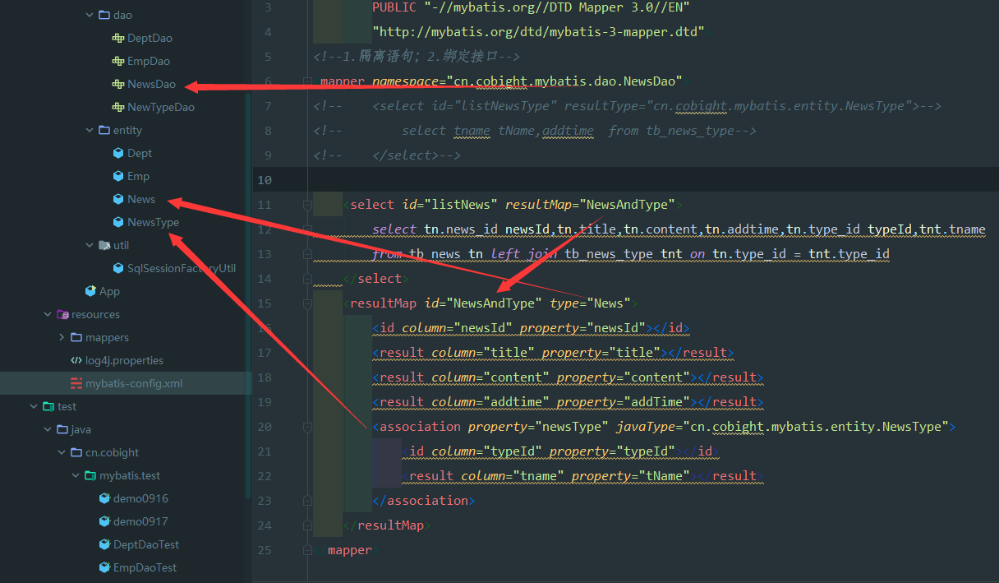
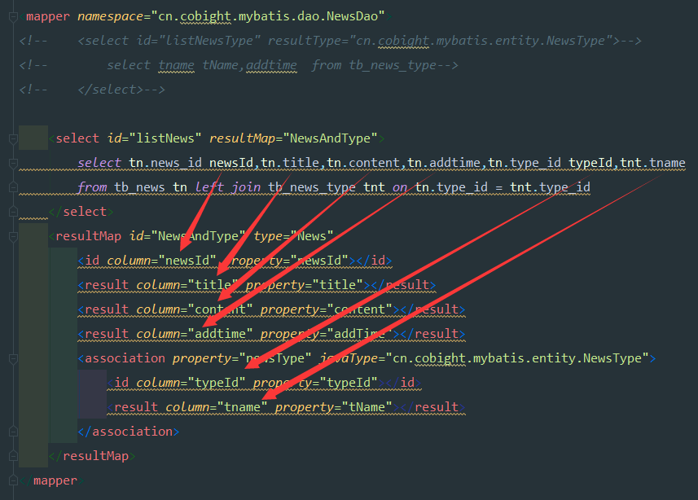
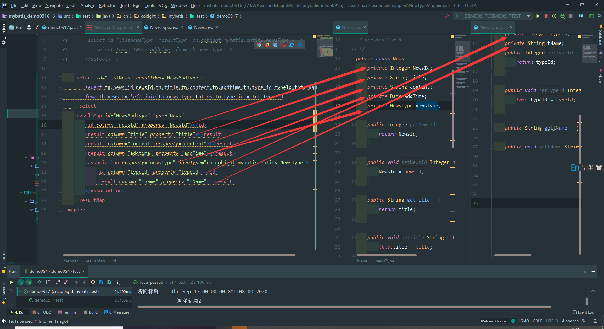
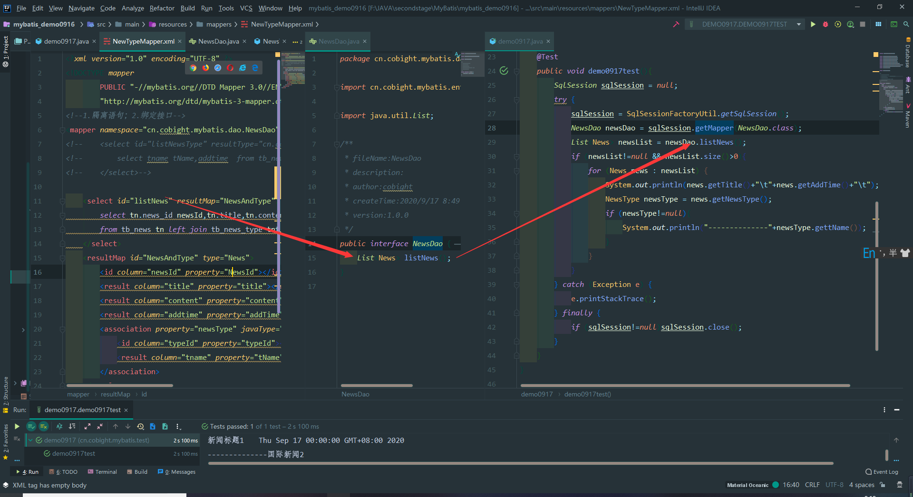
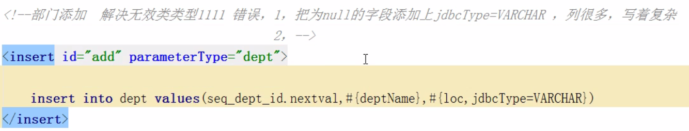

# 流程一

配置加载

typeAliases别名是否加载

mybatis-config.xml中mappers中是否加入对应mapper

# 流程二

属性对照

sql语句属性与配置对照

property与javabean对照

（好像大小写不用那么严谨....）

# 流程三

**Dao的绑定**

**方法的绑定与配置**

# 流程四

----.xml配置里sql语句中null值崩溃

解决办法：设置对应的jdbcType，而且都是大写

