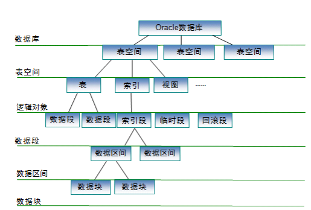
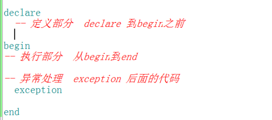
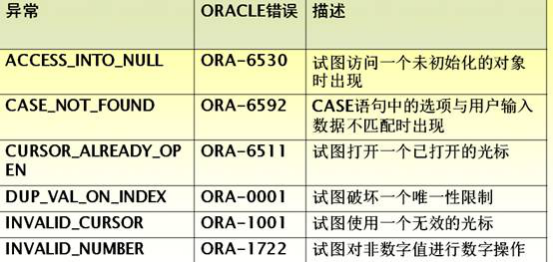
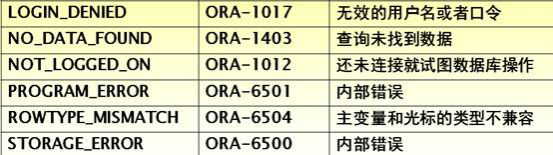
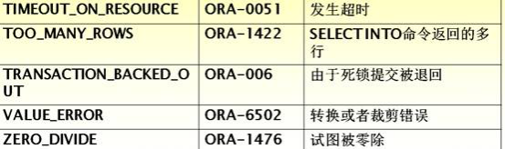
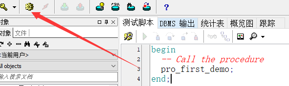
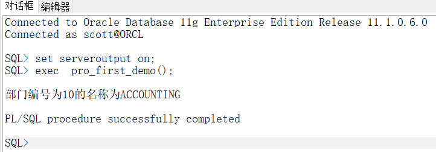

# Oracle数据库

## 五大服务

vss(volume shadow cppy service) writr service
基础设备（磁盘，阵列等）创建高保真的时间点影像的一个服务

dbconsoleorcl(sid)
使用em ( enterprise manager )进行后台管理,必须打开该服务

job scheduler orcl
服务作业调度的一个服务

TNSListener（使用oralce时，必须启动的）1521 mysql:3306  sqlserver:1433
监听服务，当数据库实例需要被访问时，该服务就必须开启

oracleServiceOrcl
当前实例的核心服务，必须启动，才能使用当前数据库实例

## 主要用户

### sys用户

相当于mysql中root用户，是超级用户，该用户维护系统信息和数据库字典的所有表和视图。数据备份，恢复，上层更改数据操作，一般使用该用户。

### system用户

默认管理员用户，拥有DBA ( database admin ）权限,管理和使用一些内部表和视图。管理其他用户功能（第2章学习用户创建，修改，删除和赋权等等，就使用该用户）。

### scott用户

一个示范用户，有4张示例表（重点两张表dept ,emp )

## plsql简介

* pl/sql(procedural language/structure query language)是一个集成开发环境

* (IDE Integrated Development Environment ) ,专门为oracle数据库设计的应用软件，对普通的sql做了增强的作用，让我们对oracle操作变得更简单。

## 数据类型

### 字符类型

**char (character)**	固定长度，最大长度2000字节。加入声明一个列的长度为phonenum char(11)电话号码11位，填写电话号码时，填的值为110剩余的8位使用空格补全，不会让其他字段再使用，所以叫固定长度。

**varchar2(var = variable可变的)	**可变长度，最大长度4000字节。数据库表设计时，最常使用，加入设计一个描述列的长度为200	describe varchar2(200)使用时只放入一个单词，good占用了4个字节，其余的196字节可以被其他的字段使用，不会被浪费

### 数值类型

**number(长度）**整型长度可以根据实际需求设置。

**number(m,n）**浮点型（小数）m代表当前小数的总长度，n表示小数点后面精确的位数。

举例来说salary number(8,2)工资的总长度是8为最大值:999999.99

### 日期类型

**date**使用时，不用加长度，默认长度为7个字节，世纪，年，月，日，时，分，秒取值范围从公元前4000多年到9999，一般业务需求，使用该类型完全可以。
**timestamp**使用时，可以精确到秒后六位。例如，做奥运会比赛项目存放短跑开始和结束时间的数据库需求设计。12.88

### 大对象类型

**clob**	当数据库要存储超过4000长度的数据时，无法使用varchar2类型，就使用clob,最大的
容量4G。如存放新闻内容。。 。 。
**blob**	二进度表示的大字段，一般用来存储图片，音频和视频等二进制文件。。。最大长度
也是4G

# 注释

单行

```sql
-- 注释内容
```

多行

```sql
/*
   注释1
   注释2
   ....
*/
```

# DDL

data definition language 数据定义语言，主要只对数据库对象的创建(create),修改（ alter ) ,删除(drop )的操作。

## create

```sql
-- create 
-- 创建新闻分类表
  create  table tb_news_type(
      type_id number(6) primary key,  --  不可以使用自增
      tname  varchar2(500) not null,
      addtime  date,
      describe  varchar(1000) 
  );
-- 创建新闻表(新闻表外键关联新闻分类表)
  create table tb_news(
      news_id number(11) primary key,
      title  varchar2(200),
      content clob,
      addtime  date,
      type_id  number(6),
      constraint fk_type_id_tbnewstype_id  foreign key(type_id) references  tb_news_type(type_id)
  );
```

## alter

```sql
-- alter  
   alter table tb_news add clicknum number(11);  -- 添加列
   alter table tb_news modify title  varchar2(500); --更新列  列改变类型或者长度变小保证该字段 为空
   alter table tb_news modify title  date; 
   alter table tb_news modify title  varchar2(500);
   alter table tb_news drop column  clicknum;
```

## drop

```sql
-- drop
   drop table tb_news_type;
```


# DML

data manipulation language数据操纵语言，主要是指insert update delete等操作

```sql
-- insert  操作
-- 获取当前时间oracle:  sysdate     				mysql:  now()
  select * from tb_news_type;
  insert into tb_news_type  values(1,'国际新闻',sysdate,'疫情很严重');
-- value
  insert into tb_news_type  value(2,'国际新闻1',sysdate,'疫情很严重1'); -- oracle 不可以 mysql可以
-- 时间日期
  insert into tb_news_type  values(3,'国际新闻2','2020-09-09 09:09:09','疫情很严重2'); -- oracle 不可以 mysql可以
-- 批量添加
  insert into tb_news_type values(1,'国际新闻',sysdate,'疫情很严重'), (2,'国际新闻2',sysdate,'疫情很严重2');-- oracle 不可以 mysql可以
```

## dual 虚表

从虚表读取固定数据

```sql
select 1,'国际新闻',sysdate,'疫情很严重' from dual
```

物理上不存在表，为了oracle的语法完整，虚构出一个表dual 

甲骨文被sun收购后也支持虚表了

## union  union all   合并结果集 

```sql
  
  select 1,'国际新闻',sysdate,'疫情很严重' ; -- 没有from的语句mysql 可以，但是Oracle不可以
  --  union 过滤重复合并结果集，结果集中没重复数据
  select 1,'国际新闻',sysdate,'疫情很严重' from dual union
  select 3,'国际新闻3',sysdate,'疫情很严重3' from dual union
  select 3,'国际新闻3',sysdate,'疫情很严重3' from dual union
  select 2,'国际新闻2',sysdate,'疫情很严重2' from dual ;
  --  union all 不过滤重复合并结果集，结果集中有重复数据
  select 1,'国际新闻',sysdate,'疫情很严重' from dual union all
  select 3,'国际新闻3',sysdate,'疫情很严重3' from dual union all
  select 3,'国际新闻3',sysdate,'疫情很严重3' from dual union all
  select 2,'国际新闻2',sysdate,'疫情很严重2' from dual ;
  
  -- 批量添加
  insert into tb_news_type
  select 3,'国际新闻3',sysdate,'疫情很严重3' from dual union
  select 3,'国际新闻3',sysdate,'疫情很严重3' from dual union
  select 2,'国际新闻2',sysdate,'疫情很严重2' from dual ;
```

## 更新和删除 和mysql完全一样


## TRUNCATE 清空

TRUNCATE TABLE TableName

特点：

1、删除表全部内容，但保留表结构

2、速度快，但不可回滚，要三思

3、触发器中没有TRUNCATE，即这个语句无法触发任何操作

4、行标识的序号重置（或者可以说：新行标识所用的计数值重置为该列的种子）

5、DELETE语句每删除一条记录都是一个事务，会产生若干"日志"。但TRUNCATE是释放整个数据页（一个页8K），所以解释了上述的第二点。

## 序列

oracle 主键或者唯一键能不能像mysql使用auto_increment关键字自增，
借助于序列对象sequence 来实现自增功能

### **创建**

```sql
-- 序列的创建
   create  sequence  seq_news_type_id  --指定序列名称
   start with 1  --  设置开始值
   increment by  1 --   设置增量、步长
   minvalue  1 -- 开始值不能小于最小值
   maxvalue  9999  -- 最大值默认为27 个9
   
   CYCLE			--NOCYCLE循环与不循环
   CACHE 20; ---CACHE(缓冲)定义存放序列的内存块的大小，默认为20。
				--OCACHE表示不对序列进行内存缓冲。对序列进行内存缓冲，可以改善序列的性能。
--  最简单序列创建
   create  sequence  seq_news_id; 
   
   select length('999999999999999999999999999') from dual;

```

当前值  取当前值时，必须先取一次下一个值

```sql
-- 序列的使用
   --   currval  =current value   当前值  取当前值时，必须先取一次下一个值
   select seq_news_type_id.currval from dual; 
   --nextval = next  value  下一个值
   select seq_news_type_id.nextval  from dual;
-- 序列的实际使用
 insert into tb_news_type values(seq_news_type_id.nextval,'国际新闻',sysdate,'疫情很严重');
```

### ALTER SEQUENCE 序列名 

不能修改序列的初始值

### 删除序列语法：

DROP SEQUENCE 序列名;

### **序列的使用** 

currval 表示序列的当前值，新序列必须使用一次nextval 才能获取到值，否则会报错
nextval 表示序列的下一个值。新序列首次使用时获取的是该序列的初始值，从第二次使用时开始按照设置的步进递增
查询序列的值：select seq_name.[currval,nextval] from dual;
SQL语句中使用：insert into table (id) values (seq_name.nextval)

### **序列在union中不可用**

```sql
select * from tb_news_type;
-- seq_news_type_id.nextval不可以在union中使用
insert into tb_news_type  values
select seq_news_type_id.nextval,'国际新闻',sysdate,'疫情很严重' from dual union 
select seq_news_type_id.nextval,'国际新闻',sysdate,'疫情很严重' from dual ;
```

## 分页

rowid  rownum  

```sql
--  oracle 分页  mysql limit
--  伪列    表的物理结构不存在，但是为了某些特性功能（例如分页或者删除重复数据等）,可以使用的一些列
--  rowid  rownum  

 select * from   tb_news_type  limit 0,2;  -- oracle不可以使用limit
 
 select * from   tb_news_type;  --物理上不存在rowid rownum
 
  select rowid,rownum,t.* from  tb_news_type t;
  select rowid,rownum,t.* from  dept t;
  select rowid,rownum,t.* from  emp t;
  
  -- 删除新闻分类中名字相同的列，留下一列
  delete from tb_news_type a  where rowid >(
  select min(rowid) from tb_news_type b where a.tname=b.tname );
```

oracle分页

```sql
-- 分页  pageNo  第几页(页码)  pageSize 每页显示数量
--     mysql分页  limit  start,pageSize
--         开始值  start =(pageNo-1)*pageSize
--     oracle分页
--         开始值  start =(pageNo-1)*pageSize
--         结束值  end  = pageNo*pageSize+1
--     为emp表查询分页数据  每页显示 pageSize = 3 条数据
--     第1 页   start = 0    end = 4
--     第2 页   start = 3    end = 7
--     第3 页   start = 6    end = 10
--     ....

--    方法1  
     select rownum,t.* from emp t where rownum>0 and rownum<4; 
     select rownum,t.* from emp t where rownum>3 and rownum<7; -- 这种起始值大于0的写分页不可以
     
     -- 再嵌套一层就可以
      select * from (select rownum rn,t.* from emp t ) a
      where a.rn>0 and a.rn<4;
      select * from (select rownum rn,t.* from emp t ) a
      where a.rn>3 and a.rn<7;
       select * from (select rownum rn,t.* from emp t ) a
      where a.rn>6 and a.rn<10;
       select * from (select rownum rn,t.* from emp t ) a
      where a.rn>9 and a.rn<13;
       select * from (select rownum rn,t.* from emp t ) a
      where a.rn>12 and a.rn<16; -- 第5页
      
--  方法2 
      select * from (select rownum rn,t.* from emp t where rownum<4) a
      where a.rn>0;
      select * from (select rownum rn,t.* from emp t where rownum<7) a
      where a.rn>3;
      select * from (select rownum rn,t.* from emp t where rownum<10) a
      where a.rn>6;
      -- ...

```


# DQL

data query language数据查询语言主要是指select操作

## 去重查询

```plsql
select distinct job from emp;
```


## 小数定位

```plsql
select job,round(avg(sal+nvl(comm,0)),2) avgsal  
from emp group by job order by  avgsal desc;
select round(avg(sal+nvl(comm,0)),2) avgsal  
from emp where job='CLERK';
```


# oracle  存储的体系结构



表空间：tablespace   系统表空间  临时表空间  等

## 表空间的管理

**概念：**

​     表空间：是数据库的逻辑划分，任何数据库对象都必须存储在某一个表空间（scott用户默认使用的表空间就是users,所以使用scott用户创建的表默认都users表空间）。表空间由一个或者多个磁盘文件构成，每个数据库至少有一个默认的表空间。表空间总大小等于所有从属于该表空间的文件大小的总和。

**创建：**

```sql
-- 表空间创建  必须使用system 或者sys用户  
create  tablespace  ts_qy119_demo  -- 指定表空间名称
datafile 'E:\app\Administrator\oradata\tsqy119demo.dbf'  --  指定表空间物理文件位置   dbf =database file
size 100m  -- 指定表空间默认大小
autoextend   on  next 50m  maxsize unlimited  -- 当默认大小用完时，自动扩展多大，没有上限

--  再次创建时，文件名称跟逻辑名称不能冲突
create  tablespace  ts_qy119_demo1  -- 指定表空间名称
datafile 'E:\app\Administrator\oradata\tsqy119demo1.dbf'  --  指定表空间物理文件位置   dbf =database file
size 150m  -- 指定表空间默认大小
autoextend   on  next 20m  maxsize unlimited  

create  tablespace  ts_qy119_demo2  -- 指定表空间名称
datafile 'E:\app\Administrator\oradata\tsqy119demo2.dbf'  --  指定表空间物理文件位置   dbf =database file
size 100m  -- 指定表空间默认大小
autoextend   on  next 20m  maxsize unlimited 
```


**删除：**

```sql
-- 删除
drop tablespace ts_qy119_demo1; -- 删逻辑不删文件

drop tablespace ts_qy119_demo1 including contents and datafiles; -- 删逻辑与文件
```

# 函数

## 拼接


```sql
-- 字符串函数
   -- concat  链接字符串
   select concat('hello',' world') from dual;  
   select concat('hello',' world','!!!!') from dual; --oracle中只能两个参数 mysql可以
   select concat(concat('hello',' world'),'!!!!') from dual;
   select 'hello'||' world'||'!!!!' from dual;  -- oracle 可以使用|| 链接多个字符串
   select concat('hello'||' world','!!!!') from dual;
   select concat(job,'-'||ename) ,job,ename  from emp; -- 实际使用
   
   
```

## 大小写转换

```plsql
-- upper lower 大小写转换   java "abc".toUpperCase()
   select upper('abc') from dual;
   select lower('ABC') from dual;
   
    select lower('AbC') from dual;
    select lower('abc') from dual;
    
    select upper(lower(ename)),lower(ename),ename from emp;  -- 实际使用
    
    
```

## 字符串位置

```plsql
-- instr 找字符位置  java indexOf  "abc".indexOf('b') = 1 "abc".lastIndexOf('b') = 1
     select instr('abc','b') from dual;  -- 下标默认从1开始 返回b在abc中第一次出现的位置
    
     select instr('abcbc','b') from dual;
     
     select instr('abcbc','b',3) from dual; -- 返回b在abc中从第3个位置开始第一次出现的位置
     select instr('abcbcbc','b',3) from dual;
     select instr('abcbcbc','b',3,2) from dual;-- 返回b在abc中从第3个位置开始第2次出现的位置
     
     select instr('abcbcbc','b',3,5) from dual; -- 返回b在abc中从第3个位置开始第5次出现的位置,没有返回0
    
```

## 字符串截取

```plsql
-- substr  java "abcdef".subString(2,4)   (开始位置，结束位置)   js  subStr(开始位置，长度) 
     select substr('abcdef',2,2) from dual; -- 和js subStr一样
     --  'fadfadsf1232221234,123134321af12321ds11,教师节快乐,233333afafd232'  
     -- 使用substr 和instr 拿到  '教师节快乐' 五个字
     -- 第2个逗号出现的位置
     select instr('fadfadsf1232221234,123134321af12321ds11,教师节快乐,233333afafd232',
     ',',1,2) from dual;
     -- 第3个逗号出现的位置
        select instr('fadfadsf1232221234,123134321af12321ds11,教师节快乐,233333afafd232',
     ',',1,3) from dual;
     --  截取长度=第3个逗号出现的位置-第2个逗号出现的位置
     select instr('fadfadsf1232221234,123134321af12321ds11,教师节快乐,233333afafd232',
     ',',1,3) - instr('fadfadsf1232221234,123134321af12321ds11,教师节快乐,233333afafd232',
     ',',1,2)  from dual;
     -- 从第2个位置开始截取
     select substr('fadfadsf1232221234,123134321af12321ds11,教师节快乐,233333afafd232',instr('fadfadsf1232221234,123134321af12321ds11,教师节快乐,233333afafd232',
     ',',1,2)+1,instr('fadfadsf1232221234,123134321af12321ds11,教师节快乐,233333afafd232',
     ',',1,3) - instr('fadfadsf1232221234,123134321af12321ds11,教师节快乐,233333afafd232',
     ',',1,2)-1) from dual;
     
     
     
```

## 字符补全

```plsql
-- rpad右补字符  lpad左补字符
        
     select rpad('aaa',10,'#') from dual; -- 把aaa在右边用#补全到10位
     select rpad('aaa',2,'#') from dual; 
     
     select lpad('aaa',10,'#') from dual;
     
     -- 生成订单   要求 订单必须是20位   订单中必须是order开头  中间含有当前日期（年月日）
     -- ‘order202009090000001’  order202009090000002  order202009100000003
     --  创建序列
     create sequence seq_order_create_id;
     -- 生成后7位
     select lpad(seq_order_create_id.nextval,7,0) from dual;
     -- 生成中间8位
     select to_char(sysdate,'yyyymmdd') from dual;
     -- 拼接订单
     select 'order'||to_char(sysdate,'yyyymmdd')||lpad(seq_order_create_id.nextval,7,0) from dual;
```

## 去重

```plsql
select distinct job from emp;
```


## 空值

用nvl(变量名,0)方法，若变量为null，则为0

## round小数精确位

```plsql
round(变量，为null时的默认值)
round（变量1，0）
```


# 用户管理

用户管理  必须使用system 或者sys用户  

```sql
-- 用户的创建
  create  user  u_qy119  -- 指定用户名称
  identified  by tiger  -- 指定密码
  default tablespace ts_qy119_demo  -- 指定默认使用的表空间
  -- 用户授权
     -- 角色 
      --connect 链接角色，拥护该角色可以使用户登录，可以查看相关逻辑对象，但是不能指定DDL操作
      --resource 资源角色，拥护该角色可以使用DDL和DML操作
      -- dba  数据库管理员角色，该角色要谨慎使用，可以对其他用户进行管理
     -- 授予权限 
     grant   connect  to   u_qy119;  -- 授予用户u_qy119  链接角色
     grant   resource  to   u_qy119;  -- 授予角色后，重新登录用户才可以测试该角色
     grant connect,resource to u_qy119; -- 一次授予多种角色
     -- 取消权限
     revoke  resource from u_qy119;
     revoke  connect from u_qy119;
       revoke  connect,resource from u_qy119; --取消多个
  -- 用户修改 （密码修改）
     alter  user u_qy119  identified by 123456;
  -- 用户的删除
     drop user u_qy119 cascade;  -- 正在登录的用户无法删除  加上级联关键字  用户被删除，用户下的所有关联对象都被删除
```

# PL/SQL语言块

## 概念：

多个语句放在一起执行，可以使用条件判断，循环，异常处理等等，为了完成一个完整的业务功能的语句集合。

## 分类：

   由基本的PL/SQL块组成PL/SQL程序，可组成不同的程序形式，它们的用途和适用性各不相同。程序形式大致有以下几种：

1、无名块：也就是没有命名的PL/SQL块，它可以是嵌入某一个应用之中的一个PL/SQL块。匿名块是出现在应用程序中的没有名字且不存储到数据库中的块。它们可以调用其他程序，却不能被其他程序调用。

​    类似 java 类写一个static{} 静态代码块

2、存储过程/函数：也就是命名了的PL/SQL块，它可以接收参数，并且可以重复地被调用。

​    有名字了，类似java中的自己写好的业务方法，编写一次可以被任何人在任何时候重复调用，不需要再去编写该业务，该方法就是一个接口，写完一个方法，写出该方法的接口文档，测试没问题的情况下，发给全组组员或者使用方法客户

3、包

命名了的PL/SQL模块，由一组相关的过程、函数和标识符组成。

 类似于java中的包，当写的业务类很多时，方便分门别类，让代码模块更清晰。两个人开发的类名称重复时，可以放在不同包解决  com.aaa.a.test.TestClass

com.aaa.b.test.TestClass

 

4、数据库触发器：是一个与具体数据库表相关联的存储PL/SQL程序。每当一个SQL操作影响到该数据库表时，系统就自动执行相应的数据库触发器。每个表最多可以有12个触发器。

   当要删除比较重要的表信息时，执行删除操作后，可以把该数据备份，该功能就可以使用触发器来实现

## 语法：

一个基本的PL/SQL块由三部分组成：定义部分、可执行部分以及例外处理部分：

***\*定义部分（java中的定义变量）：\****

定义将在可执行部分中调用的所有变量、常量、游标和用户自定义的例外处理。这部分可以没有。

***\*可执行部分（java中的方法执行）：\****

包括对数据库中进行操作的SQL语句，以及对块中进行组织、控制的PL/SQL语句。这部分必须存在。

***\*例外处理部分（java中的 try  catch finally）：\****

对可执行部分中的语句，在执行过程中出错或出现非正常现象时所做的



## 语句块的数据类型

​     等同于oracle 的数据类型（其实多于oracle的数据类型）

​     字符类型  char  varchar2

​     数值类型  number (长度)  number(m,n)

​     时间类型  date  timstamp

​     大数据类型  clob  blob

## 匿名存储过程块

```sql
declare   
 -- 定义部分(变量，常量，游标，自定义异常)
  t_empno  number(4);  -- int  t_empno  定义员工编号变量
  t_ename  varchar2(20);  -- 定义员工姓名变量
  t_hiredate  date; -- 定义员工雇佣日期
begin
  -- 执行部分
    --  给定义变量赋值 :=       &变量  接受用户输入信息
  t_empno :=  &empno;
    -- 查询并赋值  into 
  select ename,hiredate into t_ename,t_hiredate  from emp  where empno=t_empno;
    -- 打印  类似 System.out.println();
   -- dbms =database manager system   to_char  把时间类型转为格式化字符串
  dbms_output.put_line('工号为'||t_empno||'的员工的姓名为'||t_ename||
  '，入职日期为'||to_char(t_hiredate,'yyyy-mm-dd'));
  -- 例外处理
  exception  
     when no_data_found  then  -- no_data_found  预定义异常 oracle已经事先定义好的异常
        dbms_output.put_line('工号为'||t_empno||'的员工不存在');  
end; 
```


## 常量的使用

```sql
-- 匿名块，定义常量的示例
-- 给你圆的半径，计算圆的面积 ，周长
declare
   -- 定义部分
   t_pi constant number(8,7) := 3.1415926;  -- 定义常量   任何地方不发生变化
   t_r  number(5,2);
   t_area  number(11,2); -- 定义面积
   t_pr  number(11,2); -- 定义周长
begin
   -- 执行部分
   t_r := &半径;
     -- 计算
   t_area := t_r*t_r*t_pi;
   t_pr := 2*t_r*t_pi;
     -- 打印
   dbms_output.put_line('半径为'||t_r||'的圆的面积为：'||t_area||',周长：'||t_pr);
end;
```


## %type  %rowtype  record  table用法

%type 定义一个变量的数据类型与已经定义的变量数据类型（已经存在的表）一致；

```sql
-- %type     获取一个表中某一个列的数据类型   作为一个变量的数据类型
declare   
 -- 定义部分(变量，常量，游标，自定义异常)
  t_empno  emp.empno%type;  -- int  t_empno  定义员工编号变量
  t_ename   emp.ename%type;  -- 定义员工姓名变量
  t_hiredate  emp.hiredate%type; -- 定义员工雇佣日期
begin
  -- 执行部分  smith
    --  给定义变量赋值 :=       &变量  接受用户输入信息
  t_empno :=  &empno;
    -- 查询并赋值  into 
  select ename,hiredate into t_ename,t_hiredate  from emp  where empno=t_empno;
    -- 打印  类似 System.out.println();
   -- dbms =database manager system   to_char  把时间类型转为格式化字符串
  dbms_output.put_line('工号为'||t_empno||'的员工的姓名为'||t_ename||
  '，入职日期为'||to_char(t_hiredate,'yyyy-mm-dd'));
  -- 例外处理
  exception  
     when no_data_found  then  -- no_data_found  预定义异常 oracle已经事先定义好的异常
        dbms_output.put_line('工号为'||t_empno||'的员工不存在');  
end;  
```

%rowtype  可以使一个变量的数据类型和一个表中的数据记录的各个列的数据类型一致；


```sql
-- %rowtype    获取某一表的一行数据的数据类型作为变量的数据类型
--  根据部门ID获取部门表的所有列 并打印
declare 
   --定义部分
   t_deptno dept.deptno%type;
   t_dept_row  dept%rowtype; --  [number(12),varchar2(14),varchar2(13)]获取部门表的一行数据的数据类型作为变量t_dept_row的数据类型
begin
   --  执行部分
   t_deptno :=  &部门编号;
     --  查询赋值
   select * into t_dept_row from dept where deptno=t_deptno;
     -- 打印
    dbms_output.put_line('部门编号为'||t_deptno||'的名称'||
    t_dept_row.dname||'，位置在'||t_dept_row.loc); 
   exception  -- 例外处理
     when no_data_found then 
     dbms_output.put_line('部门编号为'||t_deptno||'的部门不存在');
 end;
```

 record  自定义记录类型（既不是取单个列也不是取整行）

```sql
-- record   自定义查询结果记录  既不一个一个变量定义，也不整行获取，按照自己定义记录结果显示
declare
   -- 定义record类型
   type type_emp_record is record(
      r_empno  emp.empno%type,
      r_em     emp.ename%type,
      r_salary emp.sal%type,
      r_hired  emp.hiredate%type
   );  
   -- 定义变量属于上面定义类型
   t_emp_record  type_emp_record;
begin
   -- 查询赋值  查询的列类型必须和 record定义类型匹配
   select  empno,ename,sal,hiredate into t_emp_record from emp where empno=&empno;
   -- 打印
   dbms_output.put_line('员工名称'||t_emp_record.r_em||',工资'||t_emp_record.r_salary||
   '入职日期：'||to_char(t_emp_record.r_hired,'yyyy-mm-dd'));
   exception
     when no_data_found then 
       dbms_output.put_line('输入编号的员工不存在');      
end;
```

table  定义记录表类型(record只能取一行，table可以取多行记录，相当于数据副本)

```sql
-- table   存放一个结果集的行和列
-- 获取部门表的行和列存入table，并打印
declare
   -- 定义table类型   of dept%rowtype  取部门表的一行数据类型作为定义的dept_table的表结构
    -- index by  定义行的下标类型
    --  binary_integer  二进制整型，该类型不能作为建表时的数据类型,只能作为集合或者数组一个下标使用
   type dept_table is table of dept%rowtype index by binary_integer;
   -- 定义变量属于上面定义类型 
   t_dept_table dept_table;
begin
   -- 查询部门表编号为10的一行数据赋给table变量一行
   select * into t_dept_table(0) from dept where deptno=10;
   -- 查询部门表编号为20的一行数据赋给table变量一行
   select * into t_dept_table(1) from dept where deptno=20;
   -- 查询部门表编号为30的一行数据赋给table变量一行
   select * into t_dept_table(2) from dept where deptno=30;
   
   -- 打印
   dbms_output.put_line('编号为10的部门名称为'||t_dept_table(0).dname
   ||',位置'||t_dept_table(0).loc );
    dbms_output.put_line('编号为20的部门名称为'||t_dept_table(1).dname
   ||',位置'||t_dept_table(1).loc );
    dbms_output.put_line('编号为30的部门名称为'||t_dept_table(2).dname
   ||',位置'||t_dept_table(2).loc );
end;
```

## 异常处理

### 1 预定义异常

ArithmeticException   NullPointException   CassCaseException   SqlException 

​      IOException    FileNotFoundException ClassNotFoundException.....







使用匿名块编写违反唯一性约束的异常

```sql
--  预定义异常示例
begin
  -- 执行部分
  insert into dept values(1,'开发1部','6楼');
  commit; --直接提交
  exception -- 例外处理
    when dup_val_on_index then 
      dbms_output.put_line('主键唯一不能重复');
      rollback; -- 回滚
end;
```

### 2 自定义异常

类似于java的自定义异常，在oracle中语句块编写过程中，为了具体的业务规则，编程需要自己定义一些异常，来帮助你完成你的具体业务。

   java 自定义异常  try  catch  finally  throw  throws

   throw  new Exception('自定义异常的描述')；  自己编写列继承Exception 

   throw  new RuntimeException('自定义异常的描述');  方法声明 throws

 

  需求，当删除部门表中某一条数据后，完成其他业务，如果没有删除成功，记录错误日志。。。。

​    （oracle删除不存在的数据时，没有预定义异常，所以要使用自定义异常）

delete from dept where deptno=60;

```sql
select * from dept;
-- 自定义异常   raise  显示抛出异常  java   throw  new CustomException('自定义异常描述');
  -- 删除一个不存在数据，数据库本身不会出错，但是处理业务时，当删除不成功时，执行删除异常错误处理
  delete from dept where deptno=2; 
declare
   -- 自定义异常
   no_data_delete_exception  exception;
begin
    -- 执行部分
    delete from dept where deptno=1; 
     -- 借助隐式游标sql   %notfound   游标属性 当数据找不到时，返回true
     --  if  条件  then  执行业务  end if; 结尾  if(){}
     if sql%notfound  then 
         raise no_data_delete_exception;  -- 显式抛出异常
     end if;
     dbms_output.put_line('删除成功，执行备份。。。');
     commit;-- 提交删除事务
    exception 
      when no_data_delete_exception then 
        dbms_output.put_line('删除失败，id不存在。。。');
        rollback; --  回滚事务
end;
```

### raise抛异常

code，msg

raise_application_error(-20001,'部门编号为30的员工的工资不能被降低');

```plsql
create or replace trigger tgr_limit_deptno30_emp  -- 触发器的名称
before -- 触发时间
update of sal,comm or delete  -- 触发事件  update of 针对对象中的某些列操作
on emp  -- 触发对象
for each row -- 行级触发  针对每一行数据触发
when(old.deptno=30) -- 满足条件  只针对部门编号为30的员工
begin
     -- 判断   :new.sal   获取更新后的工资   :old.sal 获取更新前的工资
    if updating('sal')  and :new.sal < :old.sal then 
           raise_application_error(-20001,'部门编号为30的员工的工资不能被降低');
    elsif   updating('comm')  and :new.comm < :old.comm  then 
           raise_application_error(-20001,'部门编号为30的员工的奖金不能被降低');
    elsif  deleting  then
           raise_application_error(-20001,'部门编号为30的员工不能被辞退');  
    else
         return;  -- 不做处理
    end if;
end;
```


## 事务控制语言（TCL transaction control language）


***\*事务四个特性：\****

​       原子性(A): 数据操作时的一个执行单元（包含多条更新操作），要么全做，要么全不做。

​            例子：假如转账操作A->B转钱，1:从A账号中扣钱，2:给B账号加钱  1和2要么全做，要么全不做

​       一致性(C)：事务的执行结果必须从一个一致性转移为另一个一致性。

​           例子：假如转账操作A->B转钱  A账号有10W  B账号有10W A和B的账号钱数总和为20W，A给B转钱1W  A账号为9W  B账号为11W  转账后总钱数依然是20W。

​       隔离性(I):一个事务的执行不能被其他事务干扰。

​          例子：A->B转钱   C->D转钱   不能从A账号扣钱后加到D账号，或者其他不合逻辑的操作

​       持久性(D):事务一旦提交，数据一旦持久化，就不会再发生变化，不受外界干扰。

***\*commit, rollback,savepoint, rollback to 实现\****

```sql
-- 事务处理  
 -- commit rollback用法
begin
   insert into dept values(1,'开发1部','1楼');
   insert into dept values(2,'开发2部','2楼');
   commit; --提交事务
   insert into dept values(3,'开发3部','3楼');
   insert into dept values(4,'开发4部','4楼');
   rollback; --回滚事务 （把在内存中缓存数据清除）
end;
 -- savepoint    rollback  to 
begin
   delete from dept where deptno<10; 
   commit;  --删除deptno小于10的，提交事务
   insert into dept values(1,'开发1部','1楼');
   savepoint  pointA; -- 设置回滚点
   insert into dept values(2,'开发2部','2楼');
   insert into dept values(3,'开发3部','3楼');
   rollback to pointA; -- 回滚到上面设置的回滚点
   insert into dept values(4,'开发4部','4楼');
   commit; -- 提交
end;
select *from dept;
```

## 表备份

```sql
-- 快速表备份  
create table tb_emp_bak  as select * from emp;
create table tb_emp_bak_20200911  as select * from emp;
create table tb_emp_bak_20200912  as select * from emp;
-- 快速备份空表
create table tb_emp_bak_20200911_1  as select * from emp where 1=2;
```

## 存储过程procedure

### 概念

​    stored procedure是一组为了完成一定业务的语句集合，经过编译后存储在数据库中。用户可以通过存储过程的名称，给出指定参数（需要参数）来执行。设计良好的一个数据库，都需要存储过程的支持。经过创建时编译一次，以后可以快速的执行，也可以被反复的调用。

### 作用

​      1，一次编译，以后执行不需编译，提高了语句的执行效率（自行编写语句的执行一次编译一次，效率低）

​      2，当实现的业务复杂时，可以节省网络开销（业务复杂包含很多的crud,和昨天举例10次请求10次响应，如果使用存储过程一次一次响应可以完成业务）

​      3， 可以被反复使用，减少数据库管理员DBA（或者开发人员）的工作量

​      4，安全性好（可以使用oracle提供的角色管理，来让不同的用户看到不同的存储过程）

###  语法

​        create  [or replace]  procedure  存储过程名称(arg1  [mode]  type1,arg2 [mode] type2....)

​          as /is  --相当于匿名块的declare

​            -- 定义部分

​          begin

​            -- 执行部分

​           exception

​             -- 异常处理

​          end;

​           mode  使用in或者out  in代表输入参数可以省略不写  out相当于存储过程的返回值

### 实例

#### 1，简单的存储过程  

（编写过程，演示所有调用方法）

```sql
-- 20200911讲课内容
-- 第一个存储过程示例  查询部门为10的部门名称，并打印
-- or replace 替换已经存在的对象
create or replace procedure  pro_first_demo  -- 指定存储过程名称
is
  t_dname dept.dname%type;
begin
    -- 查询赋值
    select dname  into t_dname from dept where deptno=10;
    --打印
    dbms_output.put_line('部门编号为10的名称为'||t_dname);
    -- 异常
    exception 
       when no_data_found then 
           dbms_output.put_line('输入部门编号不存在');
end;
```

##### 测试

-- 如何调用测试存储过程
 -- 方法1  使用pl/sql浏览器窗口，找到存储过程，右键->测试



```sql
  -- 方法2 使用匿名块测试
  begin 
      pro_first_demo();
  end;
  -- 方法3  在sql窗口使用call
  call pro_first_demo();
  -- 方法4  在命令窗口使用exec=execute
   set serveroutput on;   --  设置窗口可以显示
   exec  pro_first_demo();  -- 执行
```



编写执行完存储过程后，有红叉说明语法有错误，点击该存储过程右键点编辑，再次执行，会有错误行提示（位置不太准确）


#### 2，存储过程 --if elsif  else

(讲解if elsif用法  带流程控制，带入参和出参)

​        员工奖金发放：

输入员工编号，如果该员工

原来没有奖金，则按照工资的10%发放

原来有奖金但不超过1000的，补到1000；

其余的按照原来奖金基础再加上10%发放；

更新成功后,返回更新后的奖金;

```sql
-- 存储过程示例2
/*
员工奖金发放：
输入员工编号，如果该员工
原来没有奖金，则按照工资的10%发放
原来有奖金但不超过1000的，补到1000；
其余的按照原来奖金基础再加上10%发放；
更新成功后,返回原来及更新后的奖金;
*/
-- 快速表备份  
create table tb_emp_bak  as select * from emp;
create table tb_emp_bak_20200911  as select * from emp;
create table tb_emp_bak_20200912  as select * from emp;
-- 快速备份空表
create table tb_emp_bak_20200911_1  as select * from emp where 1=2;
/* if 条件1 and/or 条件2  then 
      处理业务 
   elsif 条件1 and/or 条件2 then  
          处理业务 
   elsif 条件1 and/or 条件2 then  
          处理业务 
   else
          处理业务
   end if;  
   */
create or replace procedure  pro_update_empcomm_byempno  -- 指定名称
(i_empno in emp.empno%type,o_result out varchar2)    -- 参数
as
   -- 定义部分
     t_old_comm emp.comm%type;
     t_new_comm emp.comm%type;
begin
   -- 执行部分
    -- 查询员奖金并赋值给变量
    select comm into t_old_comm from tb_emp_bak where empno=i_empno;
    -- 判断更新
    if  t_old_comm is null or t_old_comm=0 then 
       update tb_emp_bak set comm=0.1*sal where empno=i_empno;
    elsif  t_old_comm<1000 then 
       update tb_emp_bak set comm=1000 where empno=i_empno;
    else
       update tb_emp_bak set comm=comm*1.1 where empno=i_empno;
    end if;
    commit; -- 提交事务
    -- 查询赋值
     select comm into t_new_comm from tb_emp_bak where empno=i_empno;
     --给返回参数赋值
     o_result := '员工编号为'||i_empno||'的原来奖金为'||nvl(t_old_comm,0)
     ||'，新奖金为'||t_new_comm;
  exception  -- 异常处理
     when no_data_found then 
       o_result := '员工编号为'||i_empno||'的员工不存在';
end;
```

##### 测试

```sql
select * from tb_emp_bak;
-- 使用匿名块测试
declare
   t_result varchar2(500);
begin
    pro_update_empcomm_byempno(7566,t_result);
    dbms_output.put_line(t_result);
end;
```

#### 3，存储过程 --case when then else ...end case

(讲解case when ...then ...  else end case用法  带流程控制，带入参和出参)

```sql
-- 存储过程示例3  case when 的用法
/*
 根据员工编号输出员工工资级别（1000以下D ，1000-2000 C ，
 2000-3000 B,3000 以上为A）
*/
create or replace procedure pro_show_salary_devel_byempno
(i_empno emp.empno%type,o_result out varchar2)
is
   t_salary emp.sal%type;
   t_devel  varchar2(1);
begin
     -- 查询赋值
    select sal into t_salary from emp where empno=i_empno;
    
    -- 判断
    case when t_salary<1000 then 
            t_devel := 'D';
         when t_salary >=1000 and t_salary<2000 then 
            t_devel := 'C';  
         when t_salary >=2000 and t_salary<3000 then 
            t_devel := 'B'; 
         else
            t_devel := 'A';
    end case;
    o_result := '编号为'||i_empno||'的工资'||t_salary||',级别为'||t_devel;     
    
end;
```


#### 4，存储过程 --三种循环

```sql
-- 存储过程示例4  循环的用法 loop  end loop;
/*
 使用不同的循环向dept的备份表插入数据
 输入参数确定写入的条数，返回插入成功多少条
*/
create table dept_bak as select * from dept where 1=2;
select * from dept_bak;
-- 循环1 
create or replace procedure pro_batch_add_deptbak
(i_num in number,o_result out varchar2)
as
   t_i number(10):=1; --定义循环变量，默认开始值为1
begin
    if  i_num<1 or i_num>10000 then
         o_result:='输入参数错误';
         return; --中断程序 
    end if;
    -- 删除数据
    -- truncate table dept;
    delete from dept_bak;
   -- 循环向部门备份表插入数据
    loop
      -- 判断退出
      if t_i>i_num then
          exit; -- 退出
      end if;
      -- exit when t_i>i_num;
        
      -- 插入数据
      insert into dept_bak values(t_i,'devteam'||t_i,t_i||'floor');
      -- 变量自增
      t_i:=t_i+1;
    end loop;
    commit; -- 提交事务
    o_result := '插入成功了'||(t_i-1)||'条';
end;

-- 循环2   while 
create or replace procedure pro_batch_add_deptbak_while
(i_num in number,o_result out varchar2)
as
   t_i number(10):=1; --定义循环变量，默认开始值为1
begin
    if  i_num<1 or i_num>10000 then
         o_result:='输入参数错误';
         return; --中断程序
    end if;
    -- 删除数据
    -- truncate table dept;
    delete from dept_bak;
   -- 循环向部门备份表插入数据  满足条件进入循环
    while t_i <= i_num loop
      -- 插入数据
      insert into dept_bak values(t_i,'devteam'||t_i,t_i||'floor');
      -- 变量自增
      t_i:=t_i+1;
    end loop;
    commit; -- 提交事务
    o_result := '插入成功了'||(t_i-1)||'条';
end;


-- 循环3   for  
create or replace procedure pro_batch_add_deptbak_for
(i_num in number,o_result out varchar2)
as
begin
    if  i_num<1 or i_num>10000 then
         o_result:='输入参数错误';
         return; --中断程序
    end if;
    -- 删除数据
    -- truncate table dept;
    delete from dept_bak;
   -- 循环向部门备份表插入数据  满足条件进入循环
    for t_i in 1..i_num loop
      -- 插入数据
      insert into dept_bak values(t_i,'devteam'||t_i,t_i||'floor');
       
    end loop;
    commit; -- 提交事务
    o_result := '插入成功了'||i_num||'条';
end;
```

## 函数function


```plsql 
-- 实例1 根据函数的入参员工的职位job ，返回该职位的平均工薪 sal
--  distinct  去重 
select distinct job from emp;

select job,round(avg(sal+nvl(comm,0)),2) avgsal  
from emp group by job order by  avgsal desc;
-------
select round(avg(sal+nvl(comm,0)),2) avgsal  
from emp where job='CLERK';
------方法
create or replace function fun_query_avgsal_byjob
(i_job in emp.job%type)
return varchar2  -- 指定返回值类型
is --as也可以,功能类似declare定义变量
   t_avgsal emp.sal%type; --定义平均工资变量
begin
   -- 查询赋值
   select round(avg(sal+nvl(comm,0)),2) into t_avgsal  
    from emp where job=i_job;
   
   -- 判断是否为空
   if t_avgsal is null then 
      return '输入职位'||i_job||'不存在';
   end if;
   
    return '职位为:'||i_job||'的平均工资为:'||t_avgsal;
    
  /* exception
     when no_data_found then 
       return '输入职位'||i_job||'不存在';
       */
end;
```


```plsql 
--  实例2 根据部门名称查询部门人数（带出参返回字符串信息，带返回值直接为部门人数）

select d.dname,count(e.empno) total from dept d left join emp e on d.deptno=e.deptno 
group by d.dname order by total desc;

create or replace function fun_query_deptnum_bydname
(i_dname in dept.dname%type,o_result out varchar2)
return number
is 
  t_deptno dept.deptno%type;
  t_deptnum  number(3);
begin
    -- 查询部门编号，并赋值
    select  deptno  into t_deptno from dept where dname=i_dname;
    -- 根据部门编号查询部门人数
    select count(*) into t_deptnum from emp where deptno=t_deptno;
    -- 给输入出参数赋值
    o_result := '部门名称为'||i_dname||'的人数为'||t_deptnum;
    -- 返回值
    return t_deptnum;
    
    exception 
      when no_data_found then
            o_result := '部门名称为'||i_dname||'的部门不存在';
            return 0;
end;
-- 匿名块测试
declare
  t_result varchar2(200);
  t_return number(3);
begin
    -- 定义返回值及输出参数，执行函数赋值
    t_return := fun_query_deptnum_bydname('ACCOUNTING',t_result);
    dbms_output.put_line(t_result||','||t_return);
end;
```

## 包package

包头

```plsql
-- 包的头部 (类似java中的接口)
  create or replace package pkg_permission
  is
      /*
        根据职位计算平均工资
        i_job  输入职位
        return  返回根据职位查询的平均工资结果
      */
      function fun_query_avgsal_byjob(i_job in emp.job%type) return varchar2;
      -- 循环批量添加 一般
      procedure pro_batch_add_deptbak (i_num in number,o_result out varchar2);
      --  循环批量添加 for
      procedure pro_batch_add_deptbak_for (i_num in number,o_result out varchar2);
  end pkg_permission;
```

包体

```plsql
-- 包的身体
  create or replace package body pkg_permission
  is
      -- 根据职位计算平均工资
      function fun_query_avgsal_byjob
      (i_job in emp.job%type)
      return varchar2  -- 指定返回值类型
      is
         t_avgsal emp.sal%type; --定义平均工资变量
      begin
         -- 查询赋值
         select round(avg(sal+nvl(comm,0)),2) into t_avgsal
          from emp where job=i_job;

         -- 判断是否为空
         if t_avgsal is null then
            return '输入职位'||i_job||'不存在';
         end if;

          return '职位为:'||i_job||'的平均工资为:'||t_avgsal;

        /* exception
           when no_data_found then
             return '输入职位'||i_job||'不存在';
             */
      end;
      -- 循环批量添加 一般
      procedure pro_batch_add_deptbak
      (i_num in number,o_result out varchar2)
      as
         t_i number(10):=1; --定义循环变量，默认开始值为1
      begin
          if  i_num<1 or i_num>10000 then
               o_result:='输入参数错误';
               return; --中断程序
          end if;
          -- 删除数据
          -- truncate table dept;
          delete from dept_bak;
         -- 循环向部门备份表插入数据
          loop
            -- 判断退出
            if t_i>i_num then
                exit; -- 退出
            end if;
            -- exit when t_i>i_num;

            -- 插入数据
            insert into dept_bak values(t_i,'devteam'||t_i,t_i||'floor');
            -- 变量自增
            t_i:=t_i+1;
          end loop;
          commit; -- 提交事务
          o_result := '插入成功了'||(t_i-1)||'条';
      end;
      -- 循环批量添加 for
      procedure pro_batch_add_deptbak_for
      (i_num in number,o_result out varchar2)
      as
      begin
          if  i_num<1 or i_num>10000 then
               o_result:='输入参数错误';
               return; --中断程序
          end if;
          -- 删除数据
          -- truncate table dept;
          delete from dept_bak;
         -- 循环向部门备份表插入数据  满足条件进入循环
          for t_i in 1..i_num loop
            -- 插入数据
            insert into dept_bak values(t_i,'devteam'||t_i,t_i||'floor');

          end loop;
          commit; -- 提交事务
          o_result := '插入成功了'||i_num||'条';
      end;
  end pkg_permission;
```

测试

```plsql
-- 测试
 -- 方法1  点开包的头部，打开functions或者procedures 看到包中的存储过程函数右键 测试
 -- 方法2 
declare
    t_rn  varchar2(200);
begin
    t_rn := pkg_permission.fun_query_avgsal_byjob('SALESMAN');
    dbms_output.put_line(t_rn);
end;
```

## 游标cursor

数据集合

### 隐含游标sql

```plsql
truncate table dept_bak;
  
declare
    t_dname dept.dname%type;
begin
    --  insert into dept_bak values(1,'devteam1','1floor');
    --   delete  from dept_bak where deptno=1;
    
    select dname into t_dname from dept_bak where deptno=1;
      -- 打印游标执行行数
       dbms_output.put_line(sql%rowcount);
      -- 判断是否执行成功
      if  sql%found then 
        dbms_output.put_line('成功执行');
      end if;
      
      
 end;
```


### 显式游标1

```plsql
--  显式游标  示例1
-- 使用步骤： 定义游标， 打开游标，提取数据，关闭游标  
  -- 使用游标提取部门表数据，并且打印结果
  
declare
    -- 定义游标   游标是一个select语句的结果集
    cursor csr_dept is select * from dept;
    -- 定义dept行变量
     t_dept_row dept%rowtype;
begin
   -- 打开游标
   open csr_dept;
   -- 提取数据
   loop
      -- 判断是否有下一行值
      if csr_dept%notfound then
          exit; --退出循环 
      end if;
      -- 游标是一个指针的体现，
      fetch  csr_dept into t_dept_row;  
      -- 打印
      dbms_output.put_line('行号'||csr_dept%rowcount||'部门名称：'||t_dept_row.dname||',位置：'
      ||t_dept_row.loc);
   end loop;
   -- 关闭游标
   close csr_dept;
end;
```

### 显示游标2

```plsql
--  显式游标  示例2
--  bulk collect用法  一次性取出游标数据  游标和table结合使用 
  -- 使用获取员工数据，并打印相关列
  
declare
  -- 定义游标
  cursor csr_emp is select * from emp;
  -- 定义table 类型
  type table_emp is table of emp%rowtype index by binary_integer; 
  -- 定义变量，使用上面定义类型
  t_table_emp table_emp;
begin
  -- 打开游标
  open csr_emp;
  -- 提取数据（bulk collect 一次性提取）
  fetch csr_emp bulk collect into t_table_emp;
  -- 关闭游标
  close csr_emp;
  
  -- 遍历table变量数据  t_table_emp.first 第一条数据的下标  
  -- t_table_emp.last  最后一条数据下标
  for t_i in t_table_emp.first..t_table_emp.last loop
     dbms_output.put_line('员工姓名'||t_table_emp(t_i).ename||
     ',雇佣日期'||to_char(t_table_emp(t_i).hiredate,'yyyy-mm-dd'));
  end loop;
    
end;  
```


### 显式游标3

```plsql
--  显式游标  示例3  参数游标的使用
  -- 根据部门编号查询员工,并打印
  
declare
  -- 定义游标  variable 
  cursor csr_emp(v_deptno number,v_ename emp.ename%type) is select * from emp
   where deptno=v_deptno and ename like '%'||v_ename||'%';
  -- 定义table 类型
  type table_emp is table of emp%rowtype index by binary_integer; 
  -- 定义变量，使用上面定义类型
  t_table_emp table_emp;
begin
  -- 打开游标
  open csr_emp(20,'S');
  -- 提取数据（bulk collect 一次性提取）
  fetch csr_emp bulk collect into t_table_emp;
  -- 关闭游标
  close csr_emp;
  
  -- 遍历table变量数据  t_table_emp.first 第一条数据的下标  
  -- t_table_emp.last  最后一条数据下标
  for t_i in t_table_emp.first..t_table_emp.last loop
     dbms_output.put_line('员工姓名'||t_table_emp(t_i).ename||
     ',雇佣日期'||to_char(t_table_emp(t_i).hiredate,'yyyy-mm-dd'));
  end loop;
    
end;  

```

### 游标定义

```plsql
-- 游标（游标变量  一次定义，多次使用）
--  定义游标变量，既可以获取部门表数据，又可以获取员工表数据，还可以获取其他任何表的数据
declare
 -- 定义游标
   -- 定义游标类型  ref =  reference  
   type type_cursor is ref cursor;
   -- 定义游标变量属于上面类型
   t_type_cursor  type_cursor;
   -- 定义行变量
   t_dept_row dept%rowtype;
   t_emp_row emp%rowtype;
begin
  -- 打开游标
  open t_type_cursor for  select * from dept;
  -- 提取数据
  loop 
      -- 提取一行数据
      fetch t_type_cursor into t_dept_row;
      -- 判断退出
      exit when t_type_cursor%notfound;
      -- 打印
      dbms_output.put_line('部门名称'||t_dept_row.dname||'位置'||t_dept_row.loc);
  end loop;
  -- 关闭游标
  close t_type_cursor;
   dbms_output.put_line('------------------------------------------------------');
  -- 打开游标
  open t_type_cursor for  select * from emp;
  -- 提取数据
  loop 
      -- 提取一行数据
      fetch t_type_cursor into t_emp_row;
      -- 判断退出
      exit when t_type_cursor%notfound;
      -- 打印
      dbms_output.put_line('员工名称'||t_emp_row.ename||'工资'||t_emp_row.sal);
  end loop;
  -- 关闭游标
  close t_type_cursor;
end;
```

### 游标简化写法

```plsql
-- 游标 (游标的简化写法  for)
declare
   -- 定义游标
   cursor csr_dept is select * from dept; 
begin
   -- 省略了打开和关闭过程
   for row_dept in csr_dept loop
       -- 打印
      dbms_output.put_line('部门名称'||row_dept.dname||'位置'||row_dept.loc);
   end loop;
end;

------------------
declare
   -- 定义游标
   --  cursor csr_dept is select * from dept; 
begin
   -- 省略了打开和关闭过程
   for row_dept in (select * from dept) loop
       -- 打印
      dbms_output.put_line('部门名称'||row_dept.dname||'位置'||row_dept.loc);
   end loop;
end;
```


# 触发器trigger

## 概念

触发是在事件发生时(DML或者登陆/退出数据库)自动的调用语句块（执行的业务）的一中oracle数据库对象.

DML触发器（进行insert update delete 操作时，隐含自动的执行语句块）

系统触发器（当登陆或者退出数据库时，隐含自动的执行语句块）

## 语法

```plsql
create [or replace]  trigger   触发器名称
before/after  触发时间（在事件之前或者之后操作）
insert/update/delete  触发事件(DML操作，多个操作时可以使用逗号隔开)
on 表名  触发对象（数据库表）
[for each row]  行级触发器时使用
begin
  --执行业务
end;
                
RAISE_APPLICATION_ERROR用法：
      RAISE_APPLICATION_ERROR(errorNumber,errorString)
      errorNumber是数值在-20000到-20999之间，errorString为自定义的错误信息。
```


## 指定时间禁止修改指定表

```plsql
-- 触发器 示例 1   
-- 周1,6 不能修改emp表
create or replace trigger tgr_limit_modify_emp  -- 指定触发器的名称
before -- 触发时间 before 在之前  after 在之后
insert or update or delete  -- 触发事件  DML事件  多个使用or隔开
on emp -- 触发对象
begin
   -- 触发后执行的业务
   if to_char(sysdate,'day') in ('星期一','星期六') then 
       -- 调用oracle提供的错误提示函数
       raise_application_error(-20001,'周一和周六不能修改emp数据');
   end if;
end;

-- 测试触发器
insert into emp(empno) values(7777);
update emp set ename='zhangsan' where empno=7369;
delete from emp;
delete from emp where deptno=30;
-- 禁用触发器
alter trigger tgr_limit_modify_emp disable;
-- 启用触发器
alter trigger tgr_limit_modify_emp enable;
-- 修改用户锁定状态
-- alter user scott account  lock;


select to_char(sysdate,'yyyy') from dual;
select to_char(sysdate,'mm') from dual;
select to_char(sysdate,'day') from dual;
select to_char(sysdate,'hh24') from dual;
select to_char(sysdate,'yyyy-mm-dd hh24:mi:ss') from dual;
-- 返回当前日期是星期几
select to_char(sysdate,'day') from dual;
select to_char(sysdate+10,'day'),sysdate+10 from dual;
select to_char(sysdate+100,'day'),sysdate+100 from dual;

select * from emp where empno in(7369,7499)
select * from emp where to_char(hiredate,'yyyy') in(1981,1982);

```

## 指定时间禁止修改指定表，抛对应异常

```plsql
-- 触发器 示例 2  
-- 周1 周6不能修改员工表  对不同的操作提示不同的错误
--条件谓词   当执行增insert 删delete  改update 时确定到底执行什么事件，不同事件触发不同业务
create or replace trigger tgr_limit_modify_emp_demo2 -- 指定触发器名称
before -- 触发时间
insert or update or delete -- 触发事件
on emp -- 触发对象
begin
    -- 判断是否是周1或者周6
   -- if to_char(sysdate,'day') in ('星期一','星期六')   then 
    if to_char(sysdate,'d') in (2,7)   then
        case when inserting then
                raise_application_error(-20002,'周1或者6不能添加数据');
             when updating then
                raise_application_error(-20003,'周1或者6不能修改数据'); 
             else -- deleting  
                raise_application_error(-20004,'周1或者6不能删除数据');  
        end case; 
    end if;
end;

-- 测试 禁用第一个 
alter trigger tgr_limit_modify_emp disable;
insert into emp(empno) values(7777);
update emp set ename='zhangsan' where empno=7369;
delete from emp;
delete from emp where deptno=30;
  

--  返回当前日期是本周的第几天   周日是第一天  从1开始 
select to_char(sysdate-1,'d') from dual;
```

## 具体行为的触发器（行级触发器）

```plsql
-- 触发器 示例 3 
--  行级触发器  针对触发对象中的数据的每一行做触发  可以和old 修改前的数据 new 修改后的数据联合使用  
-- 部门30 的人工资不能降低，奖金不能低，也不能删除 
create or replace trigger tgr_limit_deptno30_emp  -- 触发器的名称
before -- 触发时间
update of sal,comm or delete  -- 触发事件  update of 针对对象中的某些列操作
on emp  -- 触发对象
for each row -- 行级触发  针对每一行数据触发
when(old.deptno=30) -- 满足条件  只针对部门编号为30的员工
begin
     -- 判断   :new.sal   获取更新后的工资   :old.sal 获取更新前的工资
    if updating('sal')  and :new.sal < :old.sal then 
           raise_application_error(-20001,'部门编号为30的员工的工资不能被降低');
    elsif   updating('comm')  and :new.comm < :old.comm  then 
           raise_application_error(-20001,'部门编号为30的员工的奖金不能被降低');
    elsif  deleting  then
           raise_application_error(-20001,'部门编号为30的员工不能被辞退');  
    else
         return;  -- 不做处理
    end if;
end;


-- 测试
select * from emp where deptno=30;
update emp set sal=1599 where empno=7499;   -- 测试降低

update emp set sal=1699 where empno=7499;   -- 测试增加
update emp set comm=299 where empno=7499;   -- 测试降低
update emp set comm=399 where empno=7499;   -- 测试增加
delete from emp where empno=7499;  --  测试删除部门30
delete from emp where empno=7369;  -- 测试删除其他部门 
```

## 级联删除的触发器

假如A表引用了个B表的一个外键，A表字段的值只能是B表里有的，如果B表删除一个记录，但是A表中有引用此记录，这样就会崩溃报错，但是设置级联修改与删除，这样就不会出现这种情况，但是若没有设置级联呢

所以可以用触发器，当修改与删除时，联动一些表，模拟出设置的级联效果

```plsql
-- 触发器 示例 4 
--  after  后置触发器 用法 
--  在修改dept表中deptno后，顺便把它级联的（cascade）的人员表中部门编号更新

-- mysql 中  主从表有外键关系时，本身支持级联删除和更新的 当主表中被关联列做修改或者删除时，从表跟着变化
-- oracle中，主从表有外键关系时，只能级联删除，不支持级联功能
-- 不级联删除时，直接删除报错  已找到子记录
delete from dept where deptno=10;
-- 添加记录
insert into EMP (EMPNO, ENAME, JOB, MGR, HIREDATE, SAL, COMM, DEPTNO)
values (7777, 'SMITH', 'CLERK', 7902, to_date('17-12-1980', 'dd-mm-yyyy'), 800.00, null, 4);
-- 级联删除时，不报错
delete from dept where deptno=1;
-- 查询结果
select * from dept;
select * from emp where empno=7777;

-- 解决就是无法级联更新的问题
update dept set deptno=11 where deptno=10;  -- 没写触发器之前，无法执行

select length('tgr_update_cascade_emp_deptno') from dual;

create or replace  trigger  tgr_update_cascade_emp_deptno  -- 指定名称
after  -- 触发时间
update  --触发事件
on dept  -- 触发对象
for each row  -- 针对每一行  old deptno=10  new deptno=60
begin
    -- 修改和它关联emp表  中deptno字段
    update emp set deptno=:new.deptno  where deptno=:old.deptno;
    -- commit; 触发器中不可以使用tcl语句
end;
```

# delete from    truncate 有什么区别： 

​     --  1， delete from 删除整表数据，可以带删除条件  truncate 不可以带删除条件
​     --  2,  delete from 速度慢，记录日志，短时间可以找回数据(oracle)  truncate 速度快，不记录日志，数据不可以找回
​     --  3， mysql     delete from 自增不会重置    truncate  自增会重置